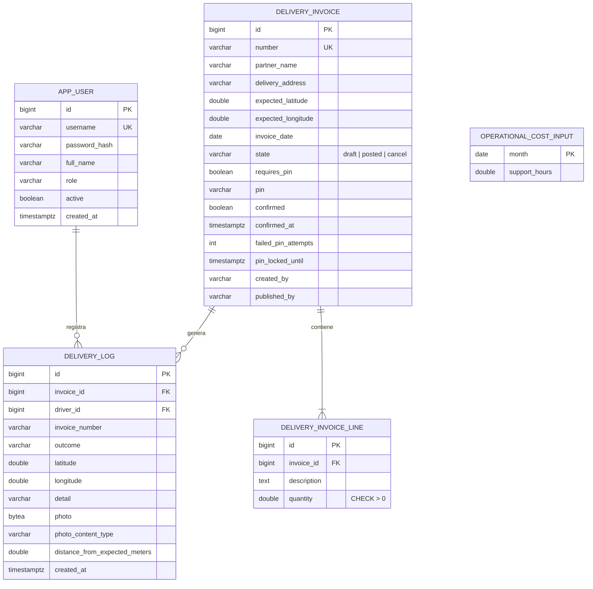

# DOCUMENTO DE MODELO DE DATOS Y ESPECIFICACIÓN DE LA API

**Plataforma interna de verificación de entregas para la empresa de retail analizada**

## Fase 3 - Diseño del Modelo y Especificación (RA3)

| Campo | Información |
|---|---|
| **Autores** | Aliatis Enzo<br>Cadme Mauro<br>Murillo Jordan<br>Suárez Galo |
| **Asignatura** | Patrones de Diseño de APIs |
| **Docente** | Patsy Malena Prieto Vélez |
| **Versión** | 1.0 |
| **Fecha** | 4 de octubre de 2026 |
| **Estado** | Para revisión |

> **Alcance.** Este documento es el entregable propio de la Fase 3: el modelo de datos
> orientado a la API y la especificación formal del contrato (OpenAPI). El contrato
> completo vive en [`openapi.json`](openapi.json); aquí se explica cómo se diseñó y cómo
> se relaciona con el esquema de base de datos.

## Contenido

1. [Modelo de datos](#1-modelo-de-datos)
2. [Del modelo a los recursos de la API](#2-del-modelo-a-los-recursos-de-la-api)
3. [Inventario de endpoints](#3-inventario-de-endpoints)
4. [Convenciones del contrato](#4-convenciones-del-contrato)
5. [Especificación OpenAPI](#5-especificación-openapi)
6. [Conclusión](#6-conclusión)

## 1. Modelo de datos

El esquema se define únicamente con migraciones Flyway
(`backend/src/main/resources/db/migration/V1` a `V5`). Hibernate corre en modo `validate`:
nunca modifica el esquema. Las migraciones solo avanzan, por lo que los cambios siguen el
patrón expand/contract.



| Tabla | Rol en el negocio | Restricciones e índices relevantes |
|---|---|---|
| `delivery_invoice` | Comprobante a entregar (réplica del contrato mínimo del ERP) con su PIN y su estado | `number` único; `state` con `CHECK` (`draft`, `posted`, `cancel`); índices GIN `pg_trgm` sobre `lower(number)` y `lower(partner_name)` para la búsqueda parcial |
| `delivery_invoice_line` | Ítems del comprobante | FK a `delivery_invoice`; `CHECK (quantity > 0)`; índice por `invoice_id` |
| `delivery_log` | Evidencia de auditoría: cada confirmación o incidencia, con foto, GPS y distancia al destino | FK a factura y a usuario; índices por `driver_id`, `invoice_id` y `created_at DESC` |
| `app_user` | Administradores y conductores (el campo `role` los distingue) | `username` único; la contraseña se guarda con BCrypt |
| `operational_cost_input` | Insumo mensual (horas de soporte) para el cálculo del costo por entrega | PK por mes |

**Decisiones de diseño con efecto en la API**

- **La evidencia se copia en `delivery_log`** (número, cliente, dirección). Un cambio posterior
  en la factura no altera lo que se registró el día de la entrega.
- **El estado es explícito y limitado.** El `CHECK` sobre `state` impide estados que la API
  no sabe representar. `cancel` existe en el modelo, pero ningún endpoint lo produce todavía.
- **Las fechas con significado de auditoría usan `timestamptz`** (V4), para no depender de la
  zona horaria del servidor.
- **Auditoría de autoría** (V5): `created_by` y `published_by` registran quién creó y quién
  publicó cada factura.
- **Las consultas de listado no traen la foto.** La columna `photo` (`bytea`) solo se lee en
  los endpoints `.../photo`; los listados usan proyecciones sin ese campo.

**Límites conocidos del modelo**

- El PIN se guarda en texto plano. Es una decisión deliberada, porque el sistema debe poder
  mostrarlo al administrador para comunicarlo al cliente; la mitigación es el bloqueo tras 5
  intentos fallidos por factura (`failed_pin_attempts`, `pin_locked_until`).
- `app_user` modela tanto administradores como conductores, y el controlador que la expone
  se llama `/admin/users`.
- Eliminar un usuario con historial viola la FK `driver_id`; la API lo traduce a `409`.

## 2. Del modelo a los recursos de la API

La API no expone las tablas tal cual. Cada recurso es una vista pensada para un consumidor
(administrador o conductor), con su propio DTO.

| Tabla | Recurso REST | DTO (schema en OpenAPI) | Consumidor |
|---|---|---|---|
| `app_user` | `/api/v1/admin/users` | `CreateDriverRequest`, `UpdateDriverRequest`, `DriverResponse` | Administrador |
| `app_user` | `/api/v1/auth/login`, `/logout` | `LoginRequest`, `LoginResponse` | Todos |
| `delivery_invoice` (+ líneas) | `/api/v1/admin/invoices` | `CreateInvoice`, `AdminInvoiceResponse` | Administrador |
| `delivery_invoice` (+ líneas) | `/api/v1/driver/invoices` | `InvoiceResponse`, `InvoiceLineResponse` | Conductor (no incluye el PIN) |
| `delivery_log` | `/api/v1/driver/deliveries/confirm`, `/incident` | `ConfirmDeliveryRequest`/`Response`, `ReportIncidentRequest`/`Response` | Conductor |
| `delivery_log` | `/api/v1/admin/deliveries`, `/driver/deliveries/history` | `DeliveryAttemptResponse`, `PageResponse*` | Administrador, conductor (solo lo propio) |
| `delivery_log` (agregado) | `/api/v1/admin/dashboard/*` | `DriverMetricResponse` | Administrador |
| `operational_cost_input` | `/api/v1/admin/cost` | `OperationalCostResponse`, `SetSupportHoursRequest` | Administrador |
| (estado en memoria) | `/api/v1/admin/resilience/*` | `CircuitBreakerStatusResponse`, `SimulateFailuresRequest` | Administrador |

Las entidades JPA nunca salen por HTTP. Los controladores solo hablan con casos de uso
(`domain/port/in`) y devuelven DTOs de `infrastructure/adapter/in/web/dto`.

## 3. Inventario de endpoints

Contrato actual: 20 rutas (23 operaciones) bajo `/api/v1`, 23 schemas, 1 esquema de seguridad.

| Verbo | Ruta | Rol | Respuestas |
|---|---|---|---|
| POST | `/auth/login` | Público | 200, 401, 429 |
| POST | `/auth/logout` | Autenticado | 204 |
| GET | `/admin/users` | Admin | 200, 400 |
| POST | `/admin/users` | Admin | 201, 400, 409 |
| PUT | `/admin/users/{id}` | Admin | 200, 400, 404, 409 |
| DELETE | `/admin/users/{id}` | Admin | 204, 404, 409 |
| GET | `/admin/invoices` | Admin | 200, 400 |
| POST | `/admin/invoices` | Admin | 201, 400, 409 |
| POST | `/admin/invoices/{id}/publish` | Admin | 200, 400 |
| GET | `/admin/deliveries` | Admin | 200, 400 |
| GET | `/admin/deliveries/{id}/photo` | Admin | 200, 404 |
| GET | `/admin/dashboard/metrics` | Admin | 200, 400 |
| GET | `/admin/dashboard/map` | Admin | 200, 400 |
| GET | `/admin/cost` | Admin | 200, 400 |
| PUT | `/admin/cost/support-hours` | Admin | 200, 400 |
| GET | `/admin/resilience/status` | Admin | 200 |
| POST | `/admin/resilience/simulate-failures` | Admin | 200, 400 |
| GET | `/driver/invoices` | Conductor, Admin | 200 |
| GET | `/driver/invoices/{id}/lines` | Conductor, Admin | 200 |
| POST | `/driver/deliveries/confirm` | Conductor, Admin | 200, 400, 409, 422, 429, 503 |
| POST | `/driver/deliveries/incident` | Conductor, Admin | 200, 400 |
| GET | `/driver/deliveries/history` | Conductor, Admin | 200, 400 |
| GET | `/driver/deliveries/{id}/photo` | Conductor, Admin | 200, 404 |

> `openapi.json` agrupa varias operaciones bajo una misma ruta (por ejemplo `GET` y `POST`
> de `/admin/users`), por eso son 20 rutas y 23 operaciones.

## 4. Convenciones del contrato

| Tema | Convención |
|---|---|
| **Versionado** | Prefijo explícito `/api/v1`. Un cambio incompatible abriría `/api/v2` sin romper a los clientes actuales. |
| **Recursos y verbos** | Sustantivos en plural; `GET` lee, `POST` crea o ejecuta una acción de negocio (`confirm`, `publish`), `PUT` reemplaza, `DELETE` elimina. |
| **Paginación** | Los listados devuelven `PageResponse<T>` (contenido, página, tamaño, total) con parámetros `page` y `size`; un `size` por encima del máximo responde `400`. |
| **Filtrado** | Búsqueda por texto (`q`) sobre número y cliente en facturas, con escape de comodines (`%`, `_`) para que el filtro no se interprete como patrón. |
| **Errores** | Una sola forma, `ErrorResponse` (`message`, `errors`, `path`, `timestamp`), producida solo por `GlobalExceptionHandler`. Los códigos están en la tabla siguiente. |
| **Idempotencia** | `POST /driver/deliveries/confirm` y `/incident` aceptan el header opcional `Idempotency-Key`: un reintento con la misma clave devuelve la respuesta anterior sin repetir el efecto. |
| **Autenticación** | Cookie `access_token` (JWT, `HttpOnly`) establecida por `POST /auth/login`. |
| **CSRF** | Doble cookie: el cliente reenvía `XSRF-TOKEN` en el header `X-XSRF-TOKEN` en toda petición que modifica datos. |
| **Autorización** | Por rol y por ruta: `/admin/**` exige `ROLE_ADMIN`; `/driver/**` admite `ADMIN` y `CONDUCTOR`. Un conductor solo ve su propio historial y sus propias fotos. |

**Códigos de error y su origen**

| Código | Cuándo | Excepción de dominio |
|---|---|---|
| 400 | Validación de campos, foto inválida, factura inexistente | `MethodArgumentNotValidException`, `DeliveryRejectedException`, `IllegalArgumentException` |
| 401 | Credenciales inválidas o sin sesión | `InvalidCredentialsException` |
| 403 | Rol insuficiente o CSRF ausente | Spring Security |
| 404 | Recurso inexistente | `DriverNotFoundException` |
| 409 | Entrega ya confirmada, usuario duplicado, borrado con historial | `DeliveryAlreadyConfirmedException`, `DriverAlreadyExistsException`, `DataIntegrityViolationException` |
| 422 | PIN incorrecto | `InvalidPinException` |
| 429 | Demasiados intentos de login o de confirmación | `TooManyLoginAttemptsException`, `TooManyConfirmAttemptsException` |
| 503 | ERP simulado caído o Circuit Breaker abierto | `ErpUnavailableException`, `CallNotPermittedException` |

## 5. Especificación OpenAPI

El contrato es [`openapi.json`](openapi.json) (OpenAPI 3.0.1, versión `1.0.0`). Se puede
explorar de forma interactiva en `/swagger-ui/index.html` del backend, protegido con Basic
Auth en producción, y se descarga en `/v3/api-docs`.

**Cómo se produce y se mantiene.** El flujo es de código a contrato, no de contrato a
código: `springdoc-openapi` genera el documento a partir de los controladores y DTO, y los
endpoints críticos (login, confirmación, incidencia, facturas, costo, resiliencia) llevan
`@Operation` y `@ApiResponses` escritos a mano, con el significado de cada código. El
archivo `docs/openapi.json` es la copia versionada que se entrega y se revisa en cada PR.
Esto significa que el contrato del repositorio no se escribió antes que el código. Lo que
sí se hizo antes fue el diseño: los recursos, los códigos de error y la forma única de
error se definieron en el diseño (Fases 1 y 2) y luego se implementaron.

**Seguridad en el contrato.** Se declara un único esquema, `sessionCookie`
(`type: apiKey`, `in: cookie`, `name: access_token`). Swagger UI solo envía la cookie si el
login se hizo desde el propio navegador con "Try it out".

**Ejemplo de operación (confirmar entrega).**

```http
POST /api/v1/driver/deliveries/confirm
Cookie: access_token=<jwt>
X-XSRF-TOKEN: <token>
Idempotency-Key: 6f1c2a9e-...
Content-Type: application/json

{ "invoiceId": 42, "pin": "123456", "latitude": -2.170998,
  "longitude": -79.922359, "photoBase64": "data:image/jpeg;base64,...",
  "photoFilename": "evidencia.jpg", "photoContentType": "image/jpeg" }
```

| Código | Cuerpo |
|---|---|
| 200 | `{ "success": true, "message": "Entrega confirmada correctamente. Evidencia guardada.", "photoUploaded": true }` |
| 422 | `{ "message": "El PIN ingresado no es correcto.", "path": "/api/v1/driver/deliveries/confirm", "timestamp": "..." }` |

## 6. Conclusión

El modelo de datos tiene cinco tablas con restricciones reales (unicidad, `CHECK`, claves
foráneas e índices) y cambia solo por migraciones. La API publica 20 rutas versionadas con
DTOs propios, una forma única de error y un contrato OpenAPI 3 versionado en el repositorio.
La principal limitación frente a un enfoque estricto de "contract-first" es que el contrato
se genera desde el código; el diseño de recursos y de errores sí precedió a la
implementación.
