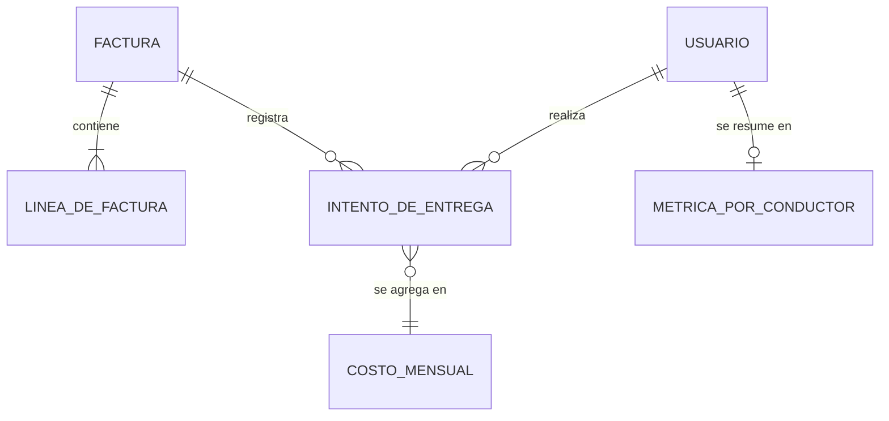

# DOCUMENTO DE MODELO DE DATOS ORIENTADO A APIS Y ESPECIFICACIÓN DEL CONTRATO

**Plataforma interna de verificación de entregas para la empresa de retail analizada**

## Fase 3 - Diseño del Modelo y Especificación (RA3)

| Campo | Información |
|---|---|
| **Autores** | Aliatis Enzo Cadme Mauro Murillo Jordan Suárez Galo |
| **Asignatura** | Patrones de Diseño de APIs |
| **Docente** | Patsy Malena Prieto Vélez |
| **Versión** | 1.0 |
| **Fecha** | 4 de octubre de 2026 |
| **Estado** | Para revisión |

## Contenido

1. [Introducción](#1-introducción)
2. [Recursos de la API](#2-recursos-de-la-api)
3. [Relaciones entre recursos](#3-relaciones-entre-recursos)
4. [Vistas por rol](#4-vistas-por-rol)
5. [Modelos de entrada y salida por operación](#5-modelos-de-entrada-y-salida-por-operación)
6. [Convenciones comunes](#6-convenciones-comunes)
7. [Contrato OpenAPI](#7-contrato-openapi)

## 1. Introducción

Este documento describe el modelo de recursos que la API expone a sus consumidores, la
aplicación del conductor y el panel administrativo, y la especificación formal que lo
respalda. Es la tercera etapa del diseño: la Fase 1 delimitó el alcance del producto (PIN
de un solo uso, evidencia fotográfica y geolocalización) y la Fase 2 eligió REST
versionado sobre JSON como estilo arquitectónico. Aquí se define qué recursos existen, qué
atributos tienen, cómo se relacionan y qué ve cada rol de ellos. El documento no describe el
almacenamiento interno: un recurso es la representación que el consumidor recibe, no la
forma en que el sistema la guarda.

El enfoque es **contract-first**. El contrato OpenAPI es la fuente de verdad de la API: un
cambio de recursos, atributos, códigos de respuesta o valores permitidos se escribe primero
en el contrato y se revisa antes de implementarse. Una prueba automática de conformidad
compara el contrato versionado con lo que el servicio publica en ejecución y falla ante
cualquier diferencia, ya sea un campo, una ruta o un código de más o de menos. De esa forma
la implementación no puede apartarse del contrato sin que el cambio sea visible y revisado.

El contrato se diseñó con tres criterios: recursos separados por consumidor, de modo que el
conductor reciba solo lo necesario para operar en campo; una sola forma de error para todas
las operaciones; y operaciones de negocio explícitas (confirmar, publicar) en lugar de
actualizaciones genéricas de estado. Donde el contrato no precisa un dato, este documento lo
marca como **por confirmar** en lugar de suponerlo.

## 2. Recursos de la API

En las tablas, la columna *Obligatorio* corresponde al modelo de entrada con el que el
recurso se crea o se envía; un guion (—) indica un atributo que solo aparece en las
respuestas y que el servicio calcula. Los tipos son los del contrato.

### 2.1 Usuario

Persona con acceso al sistema, administradora o conductora.

| Atributo | Tipo | Obligatorio | Descripción |
|---|---|---|---|
| `id` | entero (int64) | — | Identificador del usuario. |
| `username` | texto | Sí (alta) | Nombre de acceso. |
| `password` | texto | Sí (alta); No (edición) | Contraseña. Nunca se devuelve. Al editar, si se omite o queda en blanco se conserva la actual. |
| `fullName` | texto | Sí | Nombre completo. |
| `role` | texto: `ADMIN`, `CONDUCTOR` | Sí (alta) | Rol del usuario. |
| `active` | booleano | Sí (edición) | Indica si el usuario puede iniciar sesión. |

### 2.2 Factura

Comprobante que se entrega al cliente. Se crea en borrador con sus líneas y se publica
después; al publicarse queda disponible para el conductor.

| Atributo | Tipo | Obligatorio | Descripción |
|---|---|---|---|
| `id` | entero (int64) | — | Identificador de la factura. |
| `number` | texto | Sí | Número del comprobante. Un número repetido responde 409. |
| `partnerName` | texto | Sí | Nombre del cliente destinatario. |
| `deliveryAddress` | texto | No | Dirección de entrega. |
| `latitude`, `longitude` | número (double) | No | Coordenadas esperadas de entrega, en la creación. En las respuestas se exponen como `expectedLatitude` y `expectedLongitude`. |
| `requiresPin` | booleano | No | Si es verdadero, al publicar se genera un PIN de seis dígitos. |
| `products` | arreglo de Línea de factura | Sí | Líneas del comprobante, solo en la creación. |
| `invoiceDate` | texto | — | Fecha del comprobante (formato por confirmar). |
| `state` | texto: `draft`, `posted`, `cancel` | — | Estado de la factura. |
| `pin` | texto | — | PIN de seis dígitos. Solo en la vista del administrador. |
| `confirmed` | booleano | — | Indica si la entrega ya fue confirmada. Solo en la vista del administrador. |
| `createdBy`, `publishedBy` | texto | — | Usuario que creó y que publicó la factura. Solo en la vista del administrador. |

### 2.3 Línea de factura

| Atributo | Tipo | Obligatorio | Descripción |
|---|---|---|---|
| `id` | entero (int64) | — | Identificador de la línea. |
| `description` | texto | Sí | Descripción del producto. |
| `quantity` | número (double) | Sí | Cantidad entregada. |

### 2.4 Intento de entrega

Registro de evidencia de cada confirmación, rechazo o incidencia. Se crea mediante las
operaciones de confirmar entrega y reportar incidencia, y se consulta como historial.

| Atributo | Tipo | Obligatorio | Descripción |
|---|---|---|---|
| `id` | entero (int64) | — | Identificador del intento. |
| `invoiceId` | entero (int64) | Sí | Factura a la que se refiere. |
| `invoiceNumber` | texto | Sí (incidencia) | Número de la factura. |
| `partnerName`, `deliveryAddress` | texto | No | Cliente y dirección de la factura. |
| `driverName` | texto | — | Conductor que realizó el intento. |
| `outcome` | texto: `CONFIRMED`, `REJECTED`, `INCIDENT` | — | Resultado del intento. |
| `latitude`, `longitude` | número (double) | Sí (confirmación); No (incidencia) | Ubicación donde se registró el intento. |
| `detail` | texto | — | Detalle del resultado: motivo de la incidencia o causa del rechazo. |
| `hasPhoto` | booleano | — | Indica si el intento tiene foto de evidencia; la foto se obtiene por separado. |
| `distanceFromExpectedMeters` | número (double) | — | Distancia, en metros, entre la ubicación registrada y la esperada. |
| `createdAt` | fecha y hora (date-time) | — | Instante del registro. |

### 2.5 Costo mensual

Costo operativo por entrega verificada de un mes (modelo de *showback* de la Fase 1).

| Atributo | Tipo | Obligatorio | Descripción |
|---|---|---|---|
| `month` | texto, `AAAA-MM` | Sí | Mes consultado o al que corresponden las horas de soporte. |
| `supportHours` | número (double) | Sí (≥ 0) | Horas de soporte del mes. En la entrada se envía como `hours`. |
| `confirmedDeliveries` | entero (int64) | — | Entregas confirmadas en el mes. |
| `evidencePhotoBytes` | entero (int64) | — | Tamaño acumulado de las fotos de evidencia, en bytes. |
| `evidenceStorageGb` | número (double) | — | Almacenamiento de evidencia en GB. |
| `infrastructureCostUsd`, `storageCostUsd`, `supportCostUsd` | número (double) | — | Costos por infraestructura, almacenamiento y soporte, en USD. |
| `totalCostUsd` | número (double) | — | Costo total del mes, en USD. |
| `costPerDeliveryUsd` | número (double) | — | Costo por entrega, en USD. |

### 2.6 Métrica por conductor

Resumen de resultados de un conductor en un rango de fechas.

| Atributo | Tipo | Obligatorio | Descripción |
|---|---|---|---|
| `driverName` | texto | — | Nombre del conductor. |
| `confirmed`, `rejected`, `incident` | entero (int64) | — | Intentos confirmados, rechazados e incidencias. |
| `total` | entero (int64) | — | Total de intentos. |

## 3. Relaciones entre recursos

- **Factura – Línea de factura (1 a N).** Una factura contiene una o más líneas; las líneas
  se envían al crearla y el conductor las consulta aparte.
- **Factura – Intento de entrega (1 a N).** Una factura puede acumular varios intentos
  (por ejemplo, un rechazo por PIN incorrecto y luego una confirmación); el intento
  referencia la factura por `invoiceId`.
- **Usuario – Intento de entrega (1 a N).** Cada intento lo realiza un conductor. El
  recurso lo identifica por `driverName` y no por un identificador de usuario (por
  confirmar si se agregará un `driverId`).
- **Usuario – Métrica por conductor (1 a 0..1).** La métrica agrupa los intentos del
  conductor en el rango solicitado; no existe como recurso propio, se calcula en cada
  consulta.
- **Intento de entrega – Costo mensual (N a 1).** El costo de un mes se calcula a partir de
  las entregas confirmadas de ese mes; tampoco se almacena como recurso independiente,
  salvo las horas de soporte que se registran por mes.

## 4. Vistas por rol

Una misma factura se presenta distinto según quién la consulte. El administrador ve el
comprobante completo; el conductor ve solo lo necesario para localizar y entregar.

| Atributo de la factura | Administrador | Conductor |
|---|---|---|
| `id`, `number`, `partnerName`, `deliveryAddress`, `invoiceDate`, `state` | Sí | Sí |
| `expectedLatitude`, `expectedLongitude` | Sí | Sí |
| `pin` | **Sí** | **No** |
| `requiresPin`, `confirmed` | Sí | No |
| `createdBy`, `publishedBy` | Sí | No |
| Líneas de la factura | Con la creación | Consulta aparte por factura |

Otras diferencias de visibilidad:

- **Alcance de la lista.** El administrador lista todas las facturas, con búsqueda y
  paginación. El conductor solo busca facturas publicadas, con PIN habilitado y aún no
  confirmadas, filtradas por número o cliente.
- **Historial.** El administrador consulta el historial de todos los conductores; el
  conductor, únicamente el propio.
- **Fotos de evidencia.** El conductor solo obtiene la foto de sus propias entregas.
- **Gestión.** Usuarios, métricas, costo y estado de resiliencia son exclusivos del
  administrador. El administrador también puede usar las operaciones del conductor.

El PIN solo se transmite al administrador; el conductor lo recibe del cliente y lo envía al
confirmar, nunca lo lee de la API.

## 5. Modelos de entrada y salida por operación

Todas las operaciones están bajo el prefijo `/api/v1`. Salvo el inicio de sesión, exigen
sesión iniciada. *Pág.* indica una respuesta paginada (sección 6).

| Método y ruta | Rol | Se envía | Se devuelve | Códigos |
|---|---|---|---|---|
| `POST /auth/login` | Público | Credenciales (`username`, `password`) y opcionalmente `remember` | `username`, `fullName`, `role`; la sesión viaja en cookie | 200, 401, 429 |
| `POST /auth/logout` | Sesión | — | Sin contenido | 204 |
| `GET /admin/users` | Admin | `page`, `size` | Pág. de Usuario | 200, 400 |
| `POST /admin/users` | Admin | Usuario (alta) | Usuario | 201, 400, 409 |
| `PUT /admin/users/{id}` | Admin | Usuario (edición) | Usuario | 200, 400, 404, 409 |
| `DELETE /admin/users/{id}` | Admin | — | Sin contenido | 204, 404, 409 |
| `GET /admin/invoices` | Admin | `q`, `page`, `size` | Pág. de Factura (vista admin) | 200, 400 |
| `POST /admin/invoices` | Admin | Factura con sus líneas | Factura (vista admin) | 201, 400, 409 |
| `POST /admin/invoices/{id}/publish` | Admin | — | Factura con PIN | 200, 400 |
| `GET /admin/deliveries` | Admin | `page`, `size` | Pág. de Intento de entrega | 200, 400 |
| `GET /admin/deliveries/{id}/photo` | Admin | — | Imagen de evidencia | 200, 404 |
| `GET /admin/dashboard/metrics` | Admin | `from`, `to` | Lista de Métrica por conductor | 200, 400 |
| `GET /admin/dashboard/map` | Admin | `from`, `to` | Lista de Intento de entrega | 200, 400 |
| `GET /admin/cost` | Admin | `month` | Costo mensual | 200, 400 |
| `PUT /admin/cost/support-hours` | Admin | `month`, `hours` | Costo mensual | 200, 400 |
| `GET /admin/resilience/status` | Admin | — | Estado del Circuit Breaker y del Retry | 200 |
| `POST /admin/resilience/simulate-failures` | Admin | `count` | Estado del Circuit Breaker y del Retry | 200, 400 |
| `GET /driver/invoices` | Conductor | `q` (obligatorio) | Lista de Factura (vista conductor) | 200 |
| `GET /driver/invoices/{id}/lines` | Conductor | — | Lista de Línea de factura | 200 |
| `POST /driver/deliveries/confirm` | Conductor | `invoiceId`, `pin`, `latitude`, `longitude`, `photoBase64` (obligatorios); `photoFilename`, `photoContentType`; cabecera `Idempotency-Key` | `success`, `message`, `photoUploaded` | 200, 400, 409, 422, 429, 503 |
| `POST /driver/deliveries/incident` | Conductor | `invoiceId`, `invoiceNumber`, `reason` (obligatorios); `partnerName`, `deliveryAddress`, `notes`, `latitude`, `longitude`; cabecera `Idempotency-Key` | `success`, `message` | 200, 400 |
| `GET /driver/deliveries/history` | Conductor | `page`, `size` | Pág. de Intento de entrega (propios) | 200, 400 |
| `GET /driver/deliveries/{id}/photo` | Conductor | — | Imagen de evidencia (propia) | 200, 404 |

Significado de los códigos propios del negocio: **409** número de factura o usuario
duplicado, entrega ya confirmada o usuario con historial que no puede eliminarse; **422**
PIN incorrecto; **429** demasiados intentos de inicio de sesión o de confirmación;
**503** servicio externo simulado no disponible (circuito abierto).

## 6. Convenciones comunes

**Paginación.** Los listados de usuarios, facturas del administrador y los dos historiales
usan `page` (desde 0, por defecto 0) y `size` (por defecto 20, **máximo 100**; un valor
mayor responde 400). La respuesta es un sobre con `content`, `page`, `size`,
`totalElements` y `totalPages`.

**Filtros.** `q` busca por número de factura o por cliente, sin distinguir mayúsculas; es
opcional en el listado del administrador y obligatorio en el del conductor. Las consultas
del tablero (`metrics` y `map`) exigen un rango `from` y `to` en formato ISO-8601, con un
**máximo de 93 días** y sin que `to` sea anterior a `from`; fuera de ello responden 400. El
costo se consulta por `month`.

**Idempotencia.** Confirmar una entrega y reportar una incidencia aceptan la cabecera
opcional `Idempotency-Key`. Un reintento con la misma clave devuelve la respuesta ya dada
sin repetir la operación, lo que protege ante cortes de red en campo.

**Estructura única de error.** Toda respuesta 4xx o 5xx de todas las operaciones tiene la
misma forma, declarada una sola vez en el contrato:

| Atributo | Tipo | Descripción |
|---|---|---|
| `message` | texto | Mensaje legible para el usuario. |
| `errors` | objeto de texto a texto | Detalle por campo; solo en errores de validación (400). |
| `path` | texto | Ruta donde ocurrió el error. |
| `timestamp` | fecha y hora | Instante del error, en UTC. |

**Seguridad de las peticiones.** Las que modifican datos requieren además la cabecera
`X-XSRF-TOKEN` (protección CSRF con doble cookie).

**Por confirmar.** El contrato no declara por operación las respuestas 401 y 403 de las
rutas protegidas, ni el formato de `invoiceDate`; el motivo de la incidencia (`reason`) es
texto libre, aunque la aplicación del conductor ofrece cinco motivos predefinidos.

## 7. Contrato OpenAPI

| Aspecto | Valor |
|---|---|
| Especificación | OpenAPI 3.0.1, versión de la API 1.0.0, documento `openapi.json` versionado con el código |
| Servidor | Relativo (`/`): el mismo origen desde el que se sirve la API |
| Seguridad | Esquema `sessionCookie`: cookie `access_token`, `HttpOnly`, que contiene un JWT y establece el inicio de sesión; aplica a todas las rutas salvo la autenticación |
| Tamaño | 20 rutas y 23 operaciones, todas bajo `/api/v1`; 24 esquemas de datos, incluido el de error |
| Versionado | Prefijo `/api/v1`; un cambio incompatible abriría `/api/v2` sin romper a los clientes vigentes |
| Consulta | Interactiva en `/swagger-ui/index.html` (con Basic Auth en producción) y descarga en `/v3/api-docs` |

El contrato se mantiene como documento fuente en el repositorio y se actualiza en el mismo
cambio que modifica la API. La prueba de conformidad de la sección 1 verifica en cada
ejecución que `/v3/api-docs` y el documento coincidan, de modo que lo que aquí se describe es
exactamente lo que la API publica.
