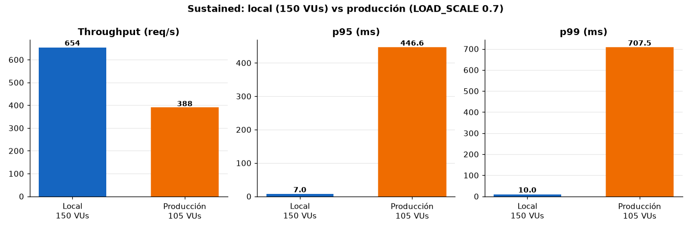
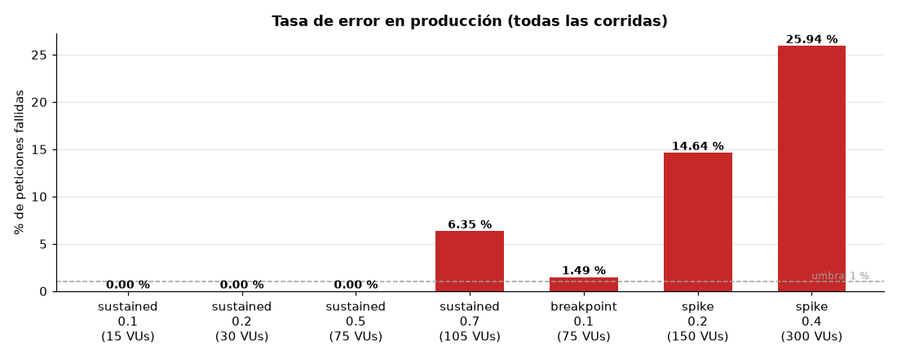
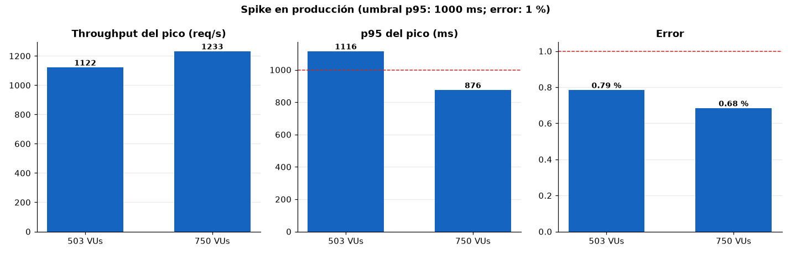

# DOCUMENTO DE DESARROLLO, SEGURIDAD, CALIDAD Y DESPLIEGUE DE LA API

**Plataforma interna de verificación de entregas para la empresa de retail analizada**

## Fase 4 - Desarrollo, Seguridad y Despliegue (RA4)

| Campo | Información |
|---|---|
| **Autores** | Aliatis Enzo Cadme Mauro Murillo Jordan Suárez Galo |
| **Asignatura** | Patrones de Diseño de APIs |
| **Docente** | Patsy Malena Prieto Vélez |
| **Versión** | 1.0 |
| **Fecha** | 28 de septiembre de 2026 |
| **Estado** | Para revisión |

> **Nota de trabajo.** Este documento reúne, como entregable propio de la Fase 4, la
> evidencia de los cuatro puntos que pide el enunciado (seguridad, calidad, rendimiento y
> DevOps). El detalle exhaustivo de cada verificación, con comandos y salidas reales, vive
> en `docs/EVALUACION_TECNICA.md`; aquí se cita puntualmente en vez de duplicarlo.

---

## Contenido

1. [Seguridad: autenticación y autorización](#1-seguridad-autenticación-y-autorización)
2. [Calidad: pruebas unitarias y cobertura](#2-calidad-pruebas-unitarias-y-cobertura)
3. [Rendimiento: pruebas de carga y estrés](#3-rendimiento-pruebas-de-carga-y-estrés)
4. [DevOps: despliegue en contenedores](#4-devops-despliegue-en-contenedores)
5. [Conclusión](#5-conclusión)

---

## 1. Seguridad: autenticación y autorización

La API usa **JWT** (no OAuth 2.0 completo, decisión de diseño para un sistema interno de
un solo cliente, justificada en `docs/Fase2_Arquitectura_Patrones_API.md` §4.5): el login
(`POST /api/v1/auth/login`) valida credenciales contra BCrypt y emite un JWT firmado con
HMAC-SHA256, con expiración configurable (480 minutos).

- **Transporte del token — cookie `HttpOnly`, no `localStorage`.** El token no viaja en el
  cuerpo de la respuesta ni se lee desde JavaScript: `AuthController.setAuthCookie` lo fija
  como cookie `access_token` (`HttpOnly`, `Secure` fuera de local, `SameSite`), y el
  frontend llama con `axios` en modo `withCredentials: true`, sin adjuntar ningún header
  `Authorization`. Esto cierra la superficie de robo de token vía XSS que señalaban
  revisiones anteriores del proyecto.
- **Autorización por rol en el backend**, no solo en el cliente: `SecurityConfig` exige
  `ROLE_ADMIN` en `/api/v1/admin/**` y admite `ADMIN`/`CONDUCTOR` en `/api/v1/driver/**`;
  `JwtAuthenticationFilter` bloquea de inmediato a un usuario desactivado
  (`userDetails.isEnabled()`).
- **Contraseñas** con BCrypt (`PasswordEncoderConfig`); ni `JWT_SECRET` ni
  `ADMIN_PASSWORD` pueden quedar en su valor de ejemplo fuera del modo demo
  (`SecretsGuardRunner`, ver §7 de `EVALUACION_TECNICA.md`).
- **Rate limiting del login**: `LoginRateLimiter` (bucket4j + Caffeine) bloquea tras 5
  intentos fallidos por IP+usuario en 60s, resetea el cupo tras un login exitoso y no se
  evade reescribiendo `X-Forwarded-For` a través del nginx real (verificado en vivo,
  `EVALUACION_TECNICA.md` §19/§21).
- **Cabeceras de seguridad y CSP** reales en la respuesta del frontend
  (`X-Content-Type-Options`, `X-Frame-Options`, `Referrer-Policy`, `Permissions-Policy` y
  una `Content-Security-Policy` acotada a lo que la app usa de verdad — OCR con
  WebAssembly, mapas Leaflet, Google Fonts), verificadas con navegador real en los flujos
  de login, tablero, OCR del conductor y descarga de evidencia.
- **PIN de entrega**: se bloquea la factura tras 5 intentos fallidos consecutivos
  (5 minutos). Se guarda en texto plano por una decisión de negocio explícita, no una
  omisión: Fase 1 §3 exige que la administración pueda leerlo para comunicarlo al cliente.
- **Documentación de la API (Swagger UI / OpenAPI)**: `/swagger-ui` y `/v3/api-docs` se
  publican a través del Nginx de borde con Basic Auth (`auth_basic` + `htpasswd`,
  `deploy/nginx/snippets/api-docs.conf`). El archivo `deploy/secrets/docs.htpasswd` queda
  fuera de git y, si falta, esas rutas responden 401 (cerradas por defecto) sin afectar a
  `/api/` ni a `/healthz`. El backend las deja sin JWT porque no es alcanzable sin pasar por
  Nginx. `springdoc.swagger-ui.csrf.enabled` hace que "Try it out" envíe `X-XSRF-TOKEN`,
  coherente con el CSRF de doble cookie. Verificado con Nginx real: 401 sin credenciales o
  con clave errónea, 200 con la correcta.
  En el Nginx de la API la raíz `/` redirige (302) a `/swagger-ui/index.html`, de modo que abrir
  el dominio de la API en el navegador lleva a la documentación; las demás rutas no definidas siguen en 404.
- **Content-Security-Policy en el Nginx de la API** (`deploy/nginx/snippets/csp-map.conf`),
  distinta por ruta y enviada desde el nivel `server` para no perder el HSTS: `/api/**`
  (solo JSON) con `default-src 'none'; frame-ancestors 'none'`, y Swagger UI / `/v3/api-docs`
  con `script-src 'self'`, `style-src 'self' 'unsafe-inline'` (React inyecta atributos
  `style`), `img-src`/`font-src` con `data:` y `connect-src 'self'`; `unsafe-inline` nunca
  en scripts. Sin recursos externos (`springdoc.swagger-ui.validator-url=none` desactiva el
  validador de swagger.io). Verificado en Chrome contra el stack real: Swagger carga completo,
  sin violaciones de CSP, y desde "Try it out" el login responde 200 y el logout 204 (con CSRF).

El esquema de seguridad se declara en el propio contrato OpenAPI
(`docs/openapi.json`, `components.securitySchemes.sessionCookie`) como una `apiKey` en la
cookie `access_token`, coherente con la implementación real.

## 2. Calidad: pruebas unitarias y cobertura

- **Backend:** 139 pruebas (`mvn test`, BUILD SUCCESS, ejecutadas en un contenedor Maven
  limpio con Testcontainers, incluidas pruebas de integración reales contra un PostgreSQL
  real — bloqueo de PIN, concurrencia con `SELECT ... FOR UPDATE`, caché real, escape de
  comodines en la búsqueda). Cobertura JaCoCo: **~80 % de instrucciones**, ~58% de ramas.
- **Contrato:** una prueba de integración compara lo que publica la API (`/v3/api-docs`) con el
  contrato versionado `docs/openapi.json` y falla ante cualquier diferencia.
- **Frontend:** 25 pruebas con Vitest + Testing Library (`apiClient`, interceptores de
  sesión/401, páginas de administración).
- El detalle por clase y por ronda de mejora está en `docs/EVALUACION_TECNICA.md` §8/§16.

## 3. Rendimiento: pruebas de carga y estrés

Herramienta: **k6** (`load-tests/`), contra el stack real levantado con
`docker compose -f deploy/docker-compose.yml --env-file deploy/env/local.env up -d --build --wait`.
Las secciones 3.1 a 3.4 corresponden al stack local; la 3.5 agrega las corridas contra la
EC2 de producción y la comparativa. Se ejecutaron los dos escenarios mínimos que exige el enunciado, más un tercero
(`breakpoint.js`) para identificar el punto de ruptura con precisión en vez de solo
describir que "no se degradó" dentro del rango probado.

### 3.1 Carga sostenida (Load/Stress Testing)

0→150 VUs en 3 min, meseta de 150 VUs por 7 min, bajada a 0 en 2 min — dentro del rango
que pide el enunciado (100-200 VUs, ramp-up 2-3 min, meseta 5-10 min, ramp-down 1-2 min).
**639,5 req/s, p95 = 5,32 ms, p99 = 7,05 ms, 0,00 % de error** (511 381 peticiones).

### 3.2 Pico extremo (Spike Testing)

0→750 VUs (5x la meseta sostenida de 150 VUs) en 30s, meseta de 1 min, bajada a 0 en 30s — dentro
del rango que pide el enunciado (5-10x la carga normal, pico de 1-2 min).
**3 075,4 req/s, p95 = 5,54 ms, p99 = 12,19 ms, 0,00 % de error** (403 397 peticiones); el
Circuit Breaker queda `CLOSED` sin ninguna llamada rechazada, sin señal de saturación.

### 3.3 Punto de ruptura (Breakpoint)

`breakpoint.js` sube la tasa de llegada de peticiones sin techo (`ramping-arrival-rate`,
500→10 000 req/s) con `abortOnFail` en los umbrales de error y de `p(95)`, así que el punto
de corte es el breakpoint real medido, no un número elegido a mano. El sistema se degrada
en **latencia** al superar los ~4 500 req/s (p95 pasa de un dígito de milisegundos a
601 ms, p99 = 699 ms), sin arrojar nunca un error HTTP — no hay caída en cascada, solo
degradación progresiva.

### 3.4 Tabla resumen

| Escenario | VUs / patrón | Throughput | Promedio | p90 | p95 | p99 | Error |
|---|---|---:|---:|---:|---:|---:|---:|
| Sostenida | 0→150→0 (12 min) | 639,5 req/s | 2,36 ms | 4,33 ms | 5,32 ms | 7,05 ms | 0,00 % |
| Spike | 0→750→0 (2 min) | 3 075,4 req/s | 2,42 ms | 4,39 ms | 5,54 ms | 12,19 ms | 0,00 % |
| Breakpoint (corte) | hasta 1 311 VUs | 4 548,9 req/s | — | 380,2 ms | 601,4 ms | 699,2 ms | 0,00 % |

**Códigos HTTP de error.** En los tres escenarios locales `http_req_failed` fue 0 %: no hubo
ninguna respuesta 4xx ni 5xx (k6 cuenta como fallida toda respuesta ≥ 400). Cada
iteración verifica además que el estado sea `200` (en el spike se acepta también `503`, que
es la respuesta esperada si el Circuit Breaker se abre, y no se produjo). En las corridas de
producción (§3.5) la tasa de error también fue 0,00 %. Los JSON de k6 no desglosan las
respuestas por código, por lo que no hay tabla por código; con 0 % de fallos, todas las
respuestas fueron 2xx.

**Sobre la rampa del spike.** El enunciado pide subir "de inmediato"; la prueba sube a 750
VUs en 30 s (25 VUs nuevos por segundo), una subida abrupta frente a la rampa de 3 min de
la carga sostenida. No es un salto instantáneo: es una desviación menor que conviene
declarar en la defensa.

### 3.5 Producción (EC2) y comparativa con local

Se repitieron los tres escenarios contra la EC2 de producción (directo, sin Cloudflare), con
`load-tests/run.sh` y `LOAD_SCALE` creciente sobre el perfil local (0,1 / 0,2 / 0,5 / 0,7
de los 150 VUs de la carga sostenida; 0,2 y 0,4 de los 750 VUs del spike; 0,1 del
breakpoint). Resultados en `load-tests/production/`.

| Escenario | VUs | Throughput | Promedio | p90 | p95 | p99 | Error |
|---|---:|---:|---:|---:|---:|---:|---:|
| Sostenida 0,1 | 15 | 62,4 req/s | — | 110,1 ms | 112,0 ms | 122,5 ms | 0,00 % |
| Sostenida 0,2 | 30 | 125,2 req/s | — | 103,0 ms | 105,0 ms | 131,5 ms | 0,00 % |
| Sostenida 0,5 | 75 | 303,0 req/s | — | 164,8 ms | 209,9 ms | 346,6 ms | 0,00 % |
| Sostenida 0,7 | 105 | 388,2 req/s | 187,7 ms | 342,0 ms | 446,6 ms | 707,5 ms | 6,35 % |
| Spike 0,2 | 150 | 450,2 req/s | 197,0 ms | 407,9 ms | 506,7 ms | 680,8 ms | 14,64 % |
| Spike 0,4 | 300 | 589,4 req/s | 531,7 ms | 1 053,9 ms | 1 137,6 ms | 2 198,9 ms | 25,94 % |
| Breakpoint 0,1 | 75 | 368,5 req/s | 134,1 ms | 191,2 ms | 289,4 ms | 505,1 ms | 1,49 % (corte) |

**Capacidad de la instancia.** La EC2 sostiene **~300 req/s (75 VUs) con 0,00 % de error y
p95 de 210 ms** y satura entre 303 y 388 req/s. Con 105 VUs sostenidos el p95 (446,6 ms)
sigue bajo 500 ms, pero el error sube a 6,35 %, por encima del 1 % que pide la rúbrica.
En el spike la instancia no cae: sigue respondiendo y el throughput aún sube (450 → 589
req/s), pero pierde entre 14,6 % y 25,9 % de las peticiones y con 300 VUs el p95 supera el
umbral de 1 000 ms. El breakpoint se cortó solo (umbral de error) a los ~2 minutos, con
1,49 % de error acumulado y un p95 de 289 ms: la saturación se manifiesta primero como
peticiones fallidas y no como latencia.

**Hallazgos sobre el comportamiento:**

- **La latencia base es de red:** el mínimo ronda 86–107 ms (RTT de ~100 ms hasta la EC2),
  frente a 5,3 ms de p95 en local; no son comparables 1 a 1.
- **Los errores son 502 del nginx de borde, no de la aplicación.** El `check` del escenario
  acepta 200 y 503, y los fallos coinciden exactamente con las peticiones fallidas
  (8 550 y 19 805), así que ninguna fue un 503 del Circuit Breaker. El log del nginx durante
  la corrida muestra `connect() to <backend>:8080 failed (99: Address not available)` y la
  respuesta `502` a esa misma petición: el nginx no logra abrir la conexión hacia el backend.
  Es el agotamiento de puertos efímeros del contenedor del nginx, que abre una conexión TCP
  nueva por cada petición (`proxy_pass` directo, sin `keepalive` hacia el backend ni HTTP/1.1)
  y deja cada una en `TIME_WAIT`. Con el rango por defecto (~28 000 puertos) y 60 s de
  `TIME_WAIT`, el techo teórico ronda los 470 conexiones por segundo, coherente con el
  punto donde empiezan los errores (303–388 req/s). Los `499` del log son peticiones que k6
  cerró al cortar la prueba. Que la causa sea esa se infiere del log y de la
  configuración. La corrección (un `upstream` con `keepalive` y HTTP/1.1 hacia el backend)
  ya está en las plantillas de nginx del repositorio, pero no se desplegó en la EC2 ni se
  repitieron las corridas: las cifras de esta sección corresponden a la configuración anterior.
- **Es un monolito en una sola instancia, la carga no se distribuye.** Todo el tráfico
  entra a un único nodo (un contenedor backend con 1 GB de memoria, una JVM, un pool de 10
  conexiones y una EC2; la BD es RDS, aparte). Por eso estas pruebas miden la capacidad *de
  una instancia*, y los seis endpoints de cada iteración comparten CPU y pool. El log
  del nginx indica que el primer límite alcanzado es la conexión nginx → backend, no la JVM;
  la CPU, la memoria del contenedor y el pool de conexiones **no se midieron** en estas
  corridas, así que no se sabe cuál limitaría después. Escalar horizontalmente es posible (la
  sesión es una cookie JWT sin estado en el servidor), pero la caché Caffeine y el rate
  limiting de bucket4j son locales a cada instancia y habría que revisarlos antes de
  agregar réplicas; la vía inmediata es vertical (más vCPU/RAM y `DB_POOL_MAX_SIZE`).
- **Frente al enunciado.** La carga sostenida de producción llegó a 105 VUs (rango de 100 a
  200) y el spike a 300 VUs, 4× los 75 VUs que la instancia sostiene sin errores (se piden
  5–10×); el breakpoint se ejecutó y se cortó sin fijar el punto exacto, porque con
  `LOAD_SCALE=0,1` el escenario ya arranca en ~300 req/s. El perfil completo (150 VUs
  sostenidos, 750 en spike, breakpoint en ~4 500 req/s) corresponde al stack local, donde
  se cumplen todos los umbrales de la rúbrica. La recuperación posterior al pico no se
  midió por separado: el resumen agrega toda la prueba.

El detalle completo, con las gráficas y los JSON crudos, vive en `load-tests/README.md`.

## 4. DevOps: despliegue en contenedores

- **Contenerización:** `backend/Dockerfile` y `frontend/Dockerfile` multi-stage, backend
  como usuario no root, healthcheck real vía Spring Actuator.
- **Orquestación:** `deploy/docker-compose.yml`, un único compose parametrizado por
  entorno (`--env-file deploy/env/<entorno>.env`) y por *profiles* (`db`, `frontend`,
  `seed`), usado tanto en local como en staging/producción.
- **CI/CD real en GitHub Actions** (no solo validado con `actionlint`): `ci.yml` corre
  build + tests en cada push/PR; `cd.yml` construye y publica imágenes versionadas en
  GitHub Container Registry, y `semantic-release` generó tags reales (`v1.0.0`–`v1.0.2`)
  a partir de Conventional Commits.
- **Frontend en producción real:** Cloudflare Pages sirve la PWA desde su integración
  nativa de Git (build y despliegue por rama, *preview* automático por PR), verificado con
  `curl -I` contra el dominio real (200, con la CSP correcta en la respuesta).
- **Backend en producción (AWS):** el backend corre en una instancia EC2 con Docker Compose
  y la base de datos en Amazon RDS for PostgreSQL. Delante va un nginx de borde que termina
  TLS con el certificado de origen de Cloudflare, reenvía `/api/` al contenedor del
  backend (la plantilla del repositorio ya usa un `upstream` con `keepalive`, pendiente de
  desplegar; ver §3.5), protege Swagger UI con Basic Auth, aplica una CSP por ruta y expone `/healthz`. El dominio de la API resuelve a
  través de Cloudflare, y las pruebas de carga de §3.5 se ejecutaron contra esta instancia.
- **Despliegue y rollback:** `deploy/scripts/deploy.sh <entorno> [tag]` descarga la imagen
  versionada, hace respaldo previo, levanta el servicio esperando los *healthchecks*,
  verifica por el nginx y, si algo falla, vuelve solo a la última imagen buena. El mismo
  script lo invoca el job `deploy-backend` de `cd.yml` (OIDC de AWS + SSM Run Command, sin
  SSH) cuando el Environment de GitHub define `AWS_REGION`, `AWS_DEPLOY_ROLE_ARN` y
  `EC2_INSTANCE_ID`; sin esas variables el job termina con una anotación de despliegue
  omitido y el despliegue se hace ejecutando el script en la instancia. El rollback vuelve a
  la imagen anterior, no al esquema (Flyway solo avanza), por lo que las migraciones siguen
  el patrón *expand/contract*.

## 5. Conclusión

Los cuatro entregables técnicos de la Fase 4 están cubiertos con evidencia ejecutada:
autenticación JWT con cookie `HttpOnly` y autorización por rol en el backend; una suite de
139 pruebas con cobertura medida y una prueba que verifica el contrato OpenAPI; pruebas de
carga con los dos escenarios que pide el enunciado más un punto de ruptura, que cumplen
todos los umbrales en el entorno local y que en producción miden la capacidad de una sola
instancia (~300 req/s sin errores) y localizan su primer límite en la conexión del nginx
hacia el backend, con una corrección ya preparada en las plantillas de despliegue; y un
pipeline de CI/CD que construye, prueba y publica versiones, con el backend desplegado en
AWS y un procedimiento de despliegue con rollback.
