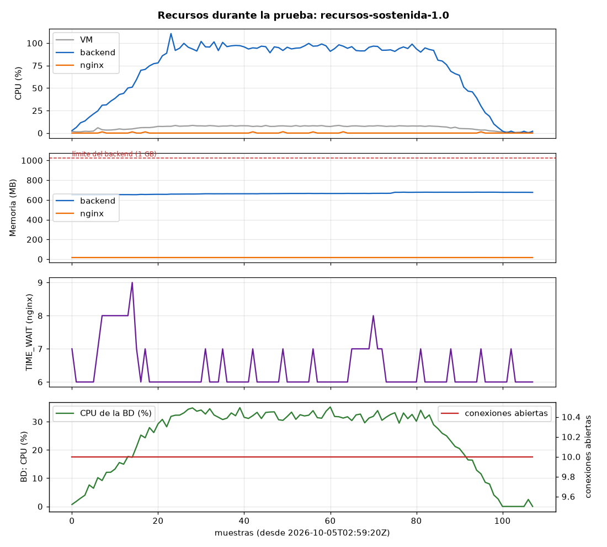
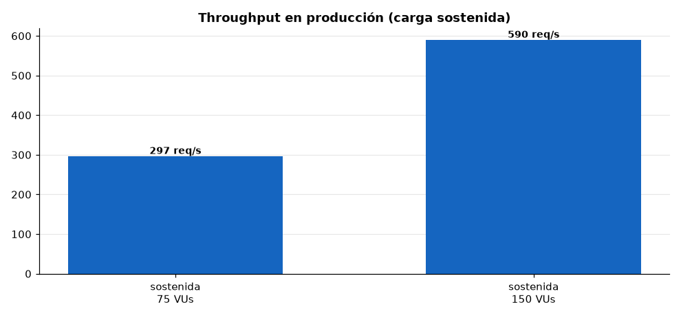
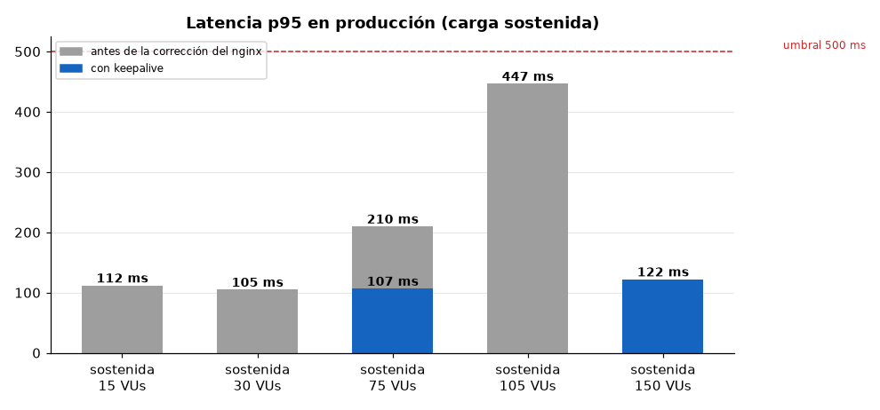
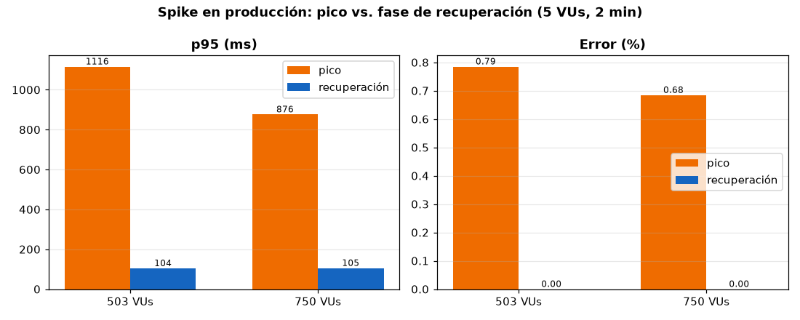
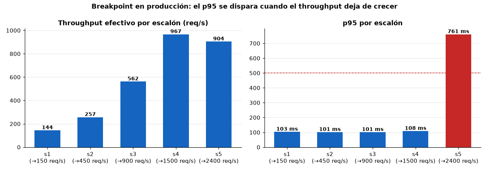
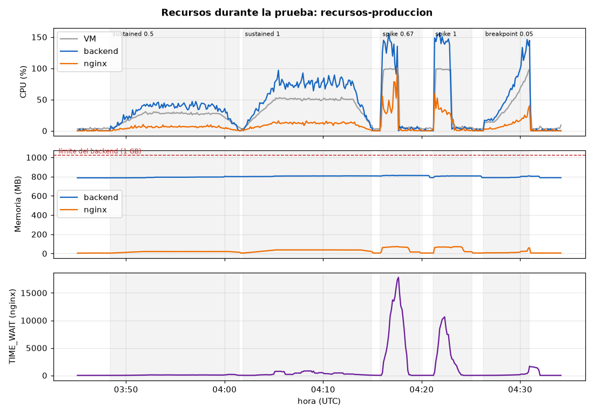

# DOCUMENTO DE DESARROLLO, SEGURIDAD, CALIDAD Y DESPLIEGUE DE LA API

**Plataforma interna de verificación de entregas para la empresa de retail analizada**

## Fase 4 - Desarrollo, Seguridad y Despliegue (RA4)

| Campo | Información |
|---|---|
| **Autores** | Aliatis Enzo Cadme Mauro Murillo Jordan Suárez Galo |
| **Asignatura** | Patrones de Diseño de APIs |
| **Docente** | Patsy Malena Prieto Vélez |
| **Versión** | 1.0 |
| **Fecha** | 28 de septiembre de 2026 |
| **Estado** | Para revisión |

> **Nota de trabajo.** Este documento reúne, como entregable propio de la Fase 4, la
> evidencia de los cuatro puntos que pide el enunciado (seguridad, calidad, rendimiento y
> DevOps). El detalle exhaustivo de cada verificación, con comandos y salidas reales, vive
> en `docs/EVALUACION_TECNICA.md`; aquí se cita puntualmente en vez de duplicarlo.

---

## Contenido

1. [Seguridad: autenticación y autorización](#1-seguridad-autenticación-y-autorización)
2. [Calidad: pruebas unitarias y cobertura](#2-calidad-pruebas-unitarias-y-cobertura)
3. [Rendimiento: pruebas de carga y estrés](#3-rendimiento-pruebas-de-carga-y-estrés)
4. [DevOps: despliegue en contenedores](#4-devops-despliegue-en-contenedores)
5. [Conclusión](#5-conclusión)

---

## 1. Seguridad: autenticación y autorización

La API usa **JWT** (no OAuth 2.0 completo, decisión de diseño para un sistema interno de
un solo cliente, justificada en `docs/Fase2_Arquitectura_Patrones_API.md` §4.5): el login
(`POST /api/v1/auth/login`) valida credenciales contra BCrypt y emite un JWT firmado con
HMAC-SHA256, con expiración configurable (480 minutos).

- **Transporte del token — cookie `HttpOnly`, no `localStorage`.** El token no viaja en el
  cuerpo de la respuesta ni se lee desde JavaScript: `AuthController.setAuthCookie` lo fija
  como cookie `access_token` (`HttpOnly`, `Secure` fuera de local, `SameSite`), y el
  frontend llama con `axios` en modo `withCredentials: true`, sin adjuntar ningún header
  `Authorization`. Esto cierra la superficie de robo de token vía XSS que señalaban
  revisiones anteriores del proyecto.
- **Autorización por rol en el backend**, no solo en el cliente: `SecurityConfig` exige
  `ROLE_ADMIN` en `/api/v1/admin/**` y admite `ADMIN`/`CONDUCTOR` en `/api/v1/driver/**`;
  `JwtAuthenticationFilter` bloquea de inmediato a un usuario desactivado
  (`userDetails.isEnabled()`).
- **Contraseñas** con BCrypt (`PasswordEncoderConfig`); ni `JWT_SECRET` ni
  `ADMIN_PASSWORD` pueden quedar en su valor de ejemplo fuera del modo demo
  (`SecretsGuardRunner`, ver §7 de `EVALUACION_TECNICA.md`).
- **Rate limiting del login**: `LoginRateLimiter` (bucket4j + Caffeine) bloquea tras 5
  intentos fallidos por IP+usuario en 60s, resetea el cupo tras un login exitoso y no se
  evade reescribiendo `X-Forwarded-For` a través del nginx real (verificado en vivo,
  `EVALUACION_TECNICA.md` §19/§21).
- **Cabeceras de seguridad y CSP** reales en la respuesta del frontend
  (`X-Content-Type-Options`, `X-Frame-Options`, `Referrer-Policy`, `Permissions-Policy` y
  una `Content-Security-Policy` acotada a lo que la app usa de verdad — OCR con
  WebAssembly, mapas Leaflet, Google Fonts), verificadas con navegador real en los flujos
  de login, tablero, OCR del conductor y descarga de evidencia.
- **PIN de entrega**: se bloquea la factura tras 5 intentos fallidos consecutivos
  (5 minutos). Se guarda en texto plano por una decisión de negocio explícita, no una
  omisión: Fase 1 §3 exige que la administración pueda leerlo para comunicarlo al cliente.
- **Documentación de la API (Swagger UI / OpenAPI)**: `/swagger-ui` y `/v3/api-docs` se
  publican a través del Nginx de borde con Basic Auth (`auth_basic` + `htpasswd`,
  `deploy/nginx/snippets/api-docs.conf`). El archivo `deploy/secrets/docs.htpasswd` queda
  fuera de git y, si falta, esas rutas responden 401 (cerradas por defecto) sin afectar a
  `/api/` ni a `/healthz`. El backend las deja sin JWT porque no es alcanzable sin pasar por
  Nginx. `springdoc.swagger-ui.csrf.enabled` hace que "Try it out" envíe `X-XSRF-TOKEN`,
  coherente con el CSRF de doble cookie. Verificado con Nginx real: 401 sin credenciales o
  con clave errónea, 200 con la correcta.
  En el Nginx de la API la raíz `/` redirige (302) a `/swagger-ui/index.html`, de modo que abrir
  el dominio de la API en el navegador lleva a la documentación; las demás rutas no definidas siguen en 404.
- **Content-Security-Policy en el Nginx de la API** (`deploy/nginx/snippets/csp-map.conf`),
  distinta por ruta y enviada desde el nivel `server` para no perder el HSTS: `/api/**`
  (solo JSON) con `default-src 'none'; frame-ancestors 'none'`, y Swagger UI / `/v3/api-docs`
  con `script-src 'self'`, `style-src 'self' 'unsafe-inline'` (React inyecta atributos
  `style`), `img-src`/`font-src` con `data:` y `connect-src 'self'`; `unsafe-inline` nunca
  en scripts. Sin recursos externos (`springdoc.swagger-ui.validator-url=none` desactiva el
  validador de swagger.io). Verificado en Chrome contra el stack real: Swagger carga completo,
  sin violaciones de CSP, y desde "Try it out" el login responde 200 y el logout 204 (con CSRF).

El esquema de seguridad se declara en el propio contrato OpenAPI
(`docs/openapi.json`, `components.securitySchemes.sessionCookie`) como una `apiKey` en la
cookie `access_token`, coherente con la implementación real.

## 2. Calidad: pruebas unitarias y cobertura

- **Backend:** 139 pruebas (`mvn test`, BUILD SUCCESS, ejecutadas en un contenedor Maven
  limpio con Testcontainers, incluidas pruebas de integración reales contra un PostgreSQL
  real — bloqueo de PIN, concurrencia con `SELECT ... FOR UPDATE`, caché real, escape de
  comodines en la búsqueda). Cobertura JaCoCo: **~80 % de instrucciones**, ~58% de ramas.
- **Contrato:** una prueba de integración compara lo que publica la API (`/v3/api-docs`) con el
  contrato versionado `docs/openapi.json` y falla ante cualquier diferencia.
- **Frontend:** 25 pruebas con Vitest + Testing Library (`apiClient`, interceptores de
  sesión/401, páginas de administración).
- El detalle por clase y por ronda de mejora está en `docs/EVALUACION_TECNICA.md` §8/§16.

## 3. Rendimiento: pruebas de carga y estrés

Herramienta: **k6** (`load-tests/`), contra el stack real levantado con
`docker compose -f deploy/docker-compose.yml --env-file deploy/env/local.env up -d --build --wait`.
Las secciones 3.1 a 3.4 corresponden al stack local; la 3.5 agrega las corridas contra la
EC2 de producción y la comparativa, y la 3.6 contrasta todo con el
enunciado. Se ejecutaron los dos escenarios mínimos que exige el enunciado, más un tercero
(`breakpoint.js`) para identificar el punto de ruptura con precisión en vez de solo
describir que "no se degradó" dentro del rango probado.

### 3.1 Carga sostenida (Load/Stress Testing)

0→150 VUs en 3 min, meseta de 150 VUs por 7 min, bajada a 0 en 2 min — dentro del rango
que pide el enunciado (100-200 VUs, ramp-up 2-3 min, meseta 5-10 min, ramp-down 1-2 min).
**654,3 req/s, p95 = 7,0 ms, p99 = 10,0 ms, 0,00 % de error** (510 889 peticiones, todas con
código 200).

**Recursos durante la carga sostenida (stack local, 150 VUs).**

| Recurso | Promedio en la meseta | Máximo | Límite / lectura |
|---|---:|---:|---|
| CPU del backend | 95,4 % de un núcleo | 110,6 % | Es el recurso que se acerca a su tope: el backend consume casi un núcleo completo |
| Memoria del backend | 664 MB | 677 MB | Límite del contenedor: 1 GB. Estable (sin crecimiento), sin reinicios ni `OOMKilled` |
| CPU de la VM (20 núcleos) | 7,8 % | 8,5 % | Holgada |
| CPU de PostgreSQL | 32,3 % | 35,2 % | Holgada: la base de datos no es el límite |
| Memoria de PostgreSQL | 62 MB | 63 MB | — |
| Conexiones abiertas a la BD | 10 | 10 | Es el pool completo (`DB_POOL_MAX_SIZE=10`); vale lo mismo en reposo, así que no prueba por sí solo que el pool se agote |

Medido con `load-tests/monitor.sh` cada 5 s sobre la meseta de 7 min (54 muestras); en esta corrida k6
llama al backend directo, de modo que el nginx no está en la ruta (su CPU es la del
reposo). Lectura: bajo 150 VUs el sistema es estable (error 0 %, memoria plana, sin reinicios) y el
primer recurso en acercarse a su límite es la CPU del backend, no la memoria ni la base de datos.

La CPU y la memoria de la EC2 durante las corridas de producción están en la sección 3.5; la base de datos
de producción (RDS) no se midió.

### 3.2 Pico extremo (Spike Testing)

0→750 VUs (5x la meseta sostenida de 150 VUs) en 10 s, pico de 1 min 30 s y bajada inmediata
a 0 en 5 s, dentro del rango que pide el enunciado (5-10x la carga normal, pico de 1-2 min).
**Pico: ~4 140 req/s, p95 = 9,53 ms, p99 = 30,17 ms, 0,00 % de error** (434 862 peticiones).
Tras el pico corre una **fase de recuperación** de 2 min con 5 VUs: p95 = 6,65 ms y 0,00 % de
error, es decir, el sistema vuelve solo a su latencia normal sin caídas en cascada. El Circuit
Breaker queda `CLOSED`, sin ninguna llamada rechazada ni reintento, sin señal de saturación.
Los códigos de respuesta fueron todos 200. La caché de lecturas y el rate limiting de la
aplicación no se aíslan en esta prueba (solo hay lecturas del admin) y se comprueban aparte en §3.7; no hay
autoescalado (una sola instancia): ver la propuesta de §3.8.

### 3.3 Punto de ruptura (Breakpoint)

`breakpoint.js` sube la tasa de llegada de peticiones sin techo (`ramping-arrival-rate`,
500→10 000 req/s) con `abortOnFail` en los umbrales de error y de `p(95)`, así que el punto
de corte es el breakpoint real medido, no un número elegido a mano. El sistema se degrada
en **latencia** al superar los ~4 500 req/s (p95 pasa de un dígito de milisegundos a
601 ms, p99 = 699 ms), sin arrojar nunca un error HTTP — no hay caída en cascada, solo
degradación progresiva.

### 3.4 Tabla resumen

| Escenario | VUs / patrón | Throughput | Promedio | p90 | p95 | p99 | Error |
|---|---|---:|---:|---:|---:|---:|---:|
| Sostenida | 0→150→0 (12 min) | 654,3 req/s | 3,3 ms | 5,7 ms | 7,0 ms | 10,0 ms | 0,00 % |
| Spike (pico) | 0→750→0 (1 min 45 s + 2 min de recuperación) | ~4 140 req/s | 4,04 ms | 6,49 ms | 9,53 ms | 30,17 ms | 0,00 % |
| Breakpoint (corte) | hasta 1 311 VUs | 4 548,9 req/s | 88,0 ms | 380,2 ms | 601,4 ms | 699,2 ms | 0,00 % |

**Códigos HTTP de error.** En los tres escenarios locales `http_req_failed` fue 0 %: no hubo
ninguna respuesta 4xx ni 5xx (k6 cuenta como fallida toda respuesta ≥ 400). Cada
iteración verifica además que el estado sea `200` (en el spike se acepta también `503`, que
es la respuesta esperada si el Circuit Breaker se abre, y no se produjo). En las corridas de
producción (§3.5) la tasa de error también fue 0,00 %. Los JSON de k6 no desglosan las
respuestas por código, por lo que no hay tabla por código; con 0 % de fallos, todas las
respuestas fueron 2xx.

**Sobre la rampa del spike.** El enunciado pide subir "de inmediato" y bajar a 0 de inmediato. La
prueba sube a 750 VUs en 10 s (75 VUs nuevos por segundo, frente a la rampa de 3 min de la carga
sostenida) y baja en 5 s. No es un salto instantáneo, pero es una subida abrupta; el pico de
1 min 30 s está dentro del rango pedido (1-2 min). La fase de recuperación, con 5 VUs, mide si
el sistema vuelve a su estado normal (p95 y error por fase en el resumen de k6).

### 3.5 Producción (EC2) y comparativa con local

Se ejecutaron los tres escenarios contra la EC2 de producción (directo, sin Cloudflare) con
`load-tests/run.sh` y `LOAD_SCALE` sobre el perfil local: carga sostenida de 75 y 150 VUs, spike con
pico de 503 y 750 VUs (más una fase de recuperación) y breakpoint. Resultados en
`load-tests/production/`.

| Escenario | VUs | Throughput | Promedio | p90 | p95 | p99 | Error |
|---|---:|---:|---:|---:|---:|---:|---:|
| Smoke | 2 | 3,3 req/s | 94,8 ms | 95,8 ms | 99,9 ms | 114,9 ms | 0,00 % |
| **Sostenida 0,5** | 75 | 296,6 req/s | 107,3 ms | 103,0 ms | 106,7 ms | 130,3 ms | **0,00 %** |
| **Sostenida 1** | **150** | 589,8 req/s | 108,4 ms | 111,4 ms | 122,2 ms | 221,2 ms | **0,00 %** |
| Spike 0,67 (pico) | 503 | ~1 122 req/s | 501,1 ms | 887,1 ms | 1 115,9 ms | 1 742,5 ms | 0,79 % |
| Spike 1 (pico) | 750 | ~1 233 req/s | 536,1 ms | 768,7 ms | 875,9 ms | 1 165,5 ms | 0,68 % |
| Spike 0,67 (recuperación) | 5 | ~25 req/s | 105,0 ms | 102,7 ms | 104,3 ms | 124,8 ms | 0,00 % |
| Spike 1 (recuperación) | 5 | ~24 req/s | 109,7 ms | 104,6 ms | 105,3 ms | 125,5 ms | 0,00 % |
| Breakpoint 0,05 | hasta 200 | 604,5 req/s (media) | 153,2 ms | 216,8 ms | 530,2 ms | 906,2 ms | 0,00 % |

**Códigos HTTP de respuesta** (conteo de k6): en la sostenida, las 232 879 y 462 757 peticiones
fueron 200; en el breakpoint, las 169 985 fueron 200; en el spike, 200 y `status 0` (peticiones sin
respuesta: 925 y 886, el 0,79 % y el 0,68 % del pico) y **ningún 5xx**, ni 502 ni 503, así que el
Circuit Breaker no se abrió. El log del nginx de esas ventanas no se revisó, por lo que la causa
concreta del `status 0` (conexión reiniciada o tiempo agotado con más de 500 VUs) queda sin confirmar.

**Spike y recuperación.** El pico sube en 10 s, se mantiene 1 min 30 s y baja a 0 en 5 s; después corre
una fase de recuperación de 2 min con 5 VUs. Con 503 VUs (6,7× los 75 VUs de la carga normal) y 750 VUs
(10×) la instancia sigue respondiendo (~1 120 y ~1 230 req/s), la latencia sube (p95 de 1 116 ms y 876 ms;
la primera supera el umbral de 1 000 ms del escenario, la segunda no, por variabilidad entre corridas) y se
pierde el 0,7–0,8 % de las peticiones, por debajo del 1 %. **Al bajar la carga el sistema se recupera solo:
p95 de 104–105 ms y 0,00 % de error en las dos corridas**, la misma latencia que en la sostenida, sin caídas
en cascada. El backend no se reinició ni tuvo `OOMKilled` (0 reinicios, `docker inspect` tras la tanda).

**Punto de ruptura.** `breakpoint.js` sube la tasa de llegada en 6 escalones de 1 min (con
`LOAD_SCALE=0,05`: de 150 a 3 000 req/s objetivo) y etiqueta cada petición con su escalón:

| Escalón | Objetivo (req/s) | Throughput efectivo | p95 | Error |
|---|---:|---:|---:|---:|
| s1 | 150 | 144 req/s | 103 ms | 0 % |
| s2 | 150→450 | 257 req/s | 101 ms | 0 % |
| s3 | 450→900 | 562 req/s | 101 ms | 0 % |
| s4 | 900→1 500 | **967 req/s** | 108 ms | 0 % |
| s5 | 1 500→2 400 | 904 req/s | **761 ms** | 0 % |

La API empieza a degradar su latencia de forma marcada entre los 900 y los 1 500 req/s de tasa objetivo, con
un **techo efectivo de ~970 req/s** (~160 iteraciones/s): el p95 pasa de ~100 ms a 761 ms (×7) cuando el
throughput deja de crecer, cruza el umbral de 500 ms y la prueba se corta a los ~4 min 41 s. **No hay errores
HTTP: se degrada en latencia, no cae.** Resolución de un escalón (1 min); en el último escalón se alcanzó
el tope de 200 VUs del escenario, así que parte de la diferencia entre objetivo y throughput efectivo puede
venir del generador de carga.

**Recursos durante las corridas (producción).**

| Corrida (ventana) | CPU de la VM (prom. / máx.) | CPU del backend, % de un núcleo (prom. / máx.) | Memoria del backend (prom.) | CPU del nginx (prom. / máx.) | `TIME_WAIT` del nginx (máx.) |
|---|---:|---:|---:|---:|---:|
| Reposo (previo a la tanda) | 3,3 % / 5,5 % | 0,9 % / 3,2 % | 787 MB | 0,2 % / 2,4 % | 8 |
| Sostenida 75 VUs (meseta de 7 min) | 27,9 % / 30,7 % | 40,4 % / 47,0 % | 793 MB | 6,6 % / 10,1 % | 103 |
| **Sostenida 150 VUs (meseta de 7 min)** | **50,6 % / 53,1 %** | 76,3 % / 96,9 % | 806 MB | 12,5 % / 15,9 % | 826 |
| Spike 503 VUs (pico de 1 min 45 s) | 90,8 % / **100,0 %** | 126,2 % / 155,8 % | 811 MB | 47,5 % / 100,9 % | 17 385 |
| Spike 750 VUs (pico de 1 min 45 s) | 88,1 % / 99,6 % | 135,4 % / 156,8 % | 804 MB | 33,3 % / 60,0 % | 10 647 |
| Breakpoint (escalones de 1 min) | 39,3 % / 95,6 % | 57,9 % / 146,0 % | 793 MB | 10,3 % / 35,6 % | 619 |

Medido con `load-tests/monitor.sh` cada 5 s en la EC2 durante toda la tanda (CSV en
`load-tests/production/recursos-produccion.csv`; 415 muestras, de 03:45 a 04:34 UTC). Las ventanas se
calculan con la hora de inicio de cada corrida de k6.

- **Carga sostenida (150 VUs): margen amplio.** La CPU de la VM ronda el 51 % (máximo 53 %) y el backend usa
  el 76 % de un núcleo; con 75 VUs, el 28 % y el 40 %. El sistema no está cerca de su límite con la carga
  que exige el enunciado.
- **El recurso que se agota es la CPU de la instancia.** En los dos picos del spike la CPU de la VM llega al
  100 % (promedio de 88–91 %) y el backend a ~156 % de un núcleo (la instancia tiene al menos 2 vCPU); en el
  breakpoint la VM llega al 95,6 % justo en el escalón en que el p95 se dispara. Es una correlación temporal,
  no un experimento, pero coincide con la degradación de latencia (p95 de 876–1 116 ms en el pico) y con
  el 0,7–0,8 % de peticiones sin respuesta.
- **La memoria no limita.** El heap del backend se mantiene en 787–814 MB sobre el límite de 1 GB durante los
  49 minutos (sin crecimiento, lo que descarta una fuga), y no hubo reinicios ni `OOMKilled`.
- **Los sockets del nginx no se agotan.** Los `TIME_WAIT` suben hasta 17 385 en el pico del spike, por debajo
  del rango de puertos efímeros (~28 000), y se mantienen en cientos con la carga sostenida.
- **Base de datos (RDS): sin medir.** El monitor solo ve contenedores y RDS es un servicio aparte; su CPU y sus
  conexiones se obtienen de CloudWatch y no se capturaron. Como referencia, el PostgreSQL local usó ~32 % de
  CPU con los mismos 150 VUs (sección 3.1).

**Comparativa con local (sostenida, mismos 150 VUs).**

| | Local | Producción |
|---|---:|---:|
| Throughput | 654,3 req/s | 589,8 req/s |
| p95 / p99 | 7,0 / 10,0 ms | 122,2 / 221,2 ms |
| Error | 0,00 % | 0,00 % |

- **Latencia base: acotada, no explicada.** El mínimo por petición en producción ronda 86–90 ms y la mediana
  ~96 ms (p95 de 122 ms con 150 VUs), frente a 7,0 ms de p95 en local. Según el desglose de k6, ese tiempo es casi
  todo espera del primer byte (`http_req_waiting`, 108,4 ms de promedio sobre 108,4 ms de duración); la conexión,
  el TLS, el envío y la recepción suman menos de 1 ms en la sostenida. Se descartaron dos causas con mediciones
  puntuales (peticiones de una en una, 10 por endpoint, una sola conexión, tiempo hasta el primer byte con `curl`
  desde WSL, el mismo entorno en que corre k6):

  | Endpoint | `curl` desde la shell de WSL | `curl` desde un contenedor Docker |
  |---|---:|---:|
  | `/healthz` (solo nginx) | 9,6 ms | 9,7 ms |
  | Facturas del conductor | 11,9 ms | 10,5 ms |
  | Historial de entregas | 10,2 ms | 10,3 ms |
  | Tablero: mapa y métricas | 10,2 / 10,3 ms | 10,3 / 10,2 ms |
  | Costo y estado de resiliencia | 10,2 / 10,2 ms | 10,3 / 10,1 ms |

  La red virtual de Docker sobre WSL2 no añade latencia (contenedor ≈ shell), y los endpoints de la carga,
  incluidos los del tablero, no son lentos por sí mismos (~10 ms, casi lo mismo que `/healthz`). La causa de los
  ~86–96 ms que registra k6 **no se determinó**: queda como hipótesis, sin comprobar, el patrón de k6 (cada VU
  lanza lotes de 6 peticiones en paralelo con la misma sesión) o un efecto de su generador. Por eso las
  latencias absolutas de producción se reportan tal como las mide k6, que es contra lo que se evalúan los
  umbrales, y no deben leerse como el tiempo de respuesta de una petición aislada (~10 ms). La forma sí es
  comparable: local y producción cumplen los umbrales con la misma carga.
- **Es un monolito en una sola instancia, la carga no se distribuye.** Todo el tráfico entra a un único nodo
  (un contenedor backend con 1 GB de memoria, una JVM, un pool de 10 conexiones y una EC2; la BD es RDS,
  aparte), así que estas pruebas miden la capacidad *de una instancia*: ~590 req/s sostenidos con error 0 % y
  un techo efectivo de ~970 req/s. Escalar horizontalmente es posible (la sesión es una cookie JWT sin estado
  en el servidor), pero la caché Caffeine y el rate limiting de bucket4j son locales a cada instancia y habría
  que revisarlos antes de agregar réplicas; la vía inmediata es vertical (más vCPU/RAM y `DB_POOL_MAX_SIZE`).

### 3.6 Cumplimiento del enunciado

| Requisito | Resultado | Estado |
|---|---|---|
| Sostenida: 100–200 VUs; subida de 2–3 min, meseta de 5–10 min, bajada de 1–2 min | 0→150 VUs en 3 min, 7 min de meseta, 2 min de bajada (local y producción) | ✅ |
| Sostenida: error < 1 % (nivel Excelente) | 0,00 % en local y en producción (150 VUs) | ✅ |
| Sostenida: p95 < 500 ms | 7,0 ms local; 122,2 ms producción | ✅ |
| Sostenida: estabilidad de CPU, memoria y base de datos | CPU y memoria medidas en producción (VM ~51 %, backend 806 MB de 1 GB, sin reinicios) y en local (§3.1, con PostgreSQL ~32 %). Falta la CPU y las conexiones de RDS (CloudWatch) | ⚠️ parcial (BD de producción sin medir) |
| Spike: 5–10× la carga normal | 750 VUs = 5× la meseta de 150 (local); 503 y 750 VUs = 6,7× y 10× los 75 VUs de carga normal (producción) | ✅ |
| Spike: subida abrupta, pico de 1–2 min, bajada a 0 inmediata | 10 s de subida, 1 min 30 s, 5 s de bajada | ✅ (no es un salto instantáneo) |
| Spike: análisis de recuperación | Fase de 2 min: p95 104–105 ms y 0 % de error en producción; 6,65 ms y 0 % en local | ✅ |
| Spike: caché, rate limiting y autoescalado | Caché (0 consultas a la BD con caché caliente en local; ~0,1 ms de servidor en producción) y rate limiting (429 tras 5 intentos, en local y en producción) comprobados (§3.7). No hay autoescalado: una sola instancia, con propuesta en §3.8 | ✅ caché y rate limiting (local y producción) · ⚠️ autoescalado no implementado |
| Rendimiento (RPS) | En cada tabla | ✅ |
| Latencia: promedio, p90, p95, p99 | En cada tabla | ✅ |
| Tasa de error y códigos HTTP | Error en cada tabla; conteo por código (200, `status 0`) | ✅ |
| Punto de ruptura exacto | Local ~4 500 req/s; producción entre 900 y 1 500 req/s objetivo, techo ~970 req/s (resolución de 1 min) | ✅ |
| Gráficas y tablas | `load-tests/*/graficas/` y tablas de las secciones 3.1–3.5 | ✅ |

El detalle completo, con las gráficas y los JSON crudos, vive en `load-tests/README.md`.

### 3.7 Caché y rate limiting (comprobación funcional, stack local)

Las pruebas de carga solo hacen lecturas que no pasan por la caché de líneas de factura ni por el limitador
de login, así que su efecto se comprueba aparte con peticiones reales
(`load-tests/verificar_cache_ratelimit.sh`, ejecutado contra el stack local con el backend recién reiniciado).

**Rate limiting del login.** Está configurado a 5 intentos por ventana de 60 s por combinación de IP y
usuario (bucket4j en memoria); solo los intentos fallidos consumen cupo y un login correcto lo libera. Con un
usuario inexistente (el límite no afecta al `admin`):

| Intento | Respuesta |
|---|---|
| 1 a 5 (usuario_prueba) | 401 |
| 6 a 8 (usuario_prueba) | **429** (`ErrorResponse`: "Demasiados intentos de inicio de sesion…") |
| Otro usuario desde la misma IP (otro_prueba) | 401, no bloqueado |
| Tras 65 s (usuario_prueba) | 401, el cupo se renovó |

El límite de `/confirm` por conductor (facturas distintas que se pueden intentar en poco tiempo) se verifica con
pruebas unitarias (`ConfirmRateLimiterTest`); no se aísla en una prueba de carga porque cada factura solo se
puede confirmar una vez.

**Cache Aside de las líneas de factura** (Caffeine, TTL de 300 s, hasta 2 000 entradas). Se leyeron 20 facturas
tres veces seguidas y se contó cuántas consultas llegaron a la tabla `delivery_invoice_line`:

| Pasada | Tiempo por lectura (promedio / mediana) | Consultas a la tabla |
|---|---:|---:|
| 1 (caché vacía) | 9,9 ms / 8,5 ms | 20 (una por factura) |
| 2 (caché caliente) | 6,6 ms / 6,6 ms | 0 |
| 3 (caché caliente) | 6,3 ms / 6,2 ms | 0 |

Repetido por separado: 40 lecturas con la caché caliente generaron **0 consultas** a la base de datos, y 20
facturas nuevas, **20**. La diferencia de latencia es pequeña porque en local la base de datos está al lado; el
efecto real es que las lecturas repetidas dejan de cargar la base de datos. Esta primera tabla es del stack local; la
siguiente es la misma comprobación contra la EC2.

**Comprobación contra producción (EC2, desde fuera, por la IP pública).** Se ejecutaron los mismos pasos con
`curl` desde la shell de WSL de la máquina que lanza k6, sin contenedor (un solo cliente, `INSECURE_TLS`):

| Intento (rate limiting) | Respuesta |
|---|---|
| 1 a 5 (usuario_prueba) | 401 |
| 6 a 8 (usuario_prueba) | **429** |
| Otro usuario desde la misma IP | 401 |
| Tras 65 s (usuario_prueba) | 401 |

El comportamiento es idéntico al del stack local. Para la caché no hay acceso a las consultas de la base de
datos (RDS), así que se midió el tiempo hasta el primer byte (conexión reutilizada, 20 facturas) y se descontó el
de `/healthz`, que responde el nginx sin tocar la aplicación:

| Medición | Tiempo hasta el primer byte | Tiempo del servidor (descontando `/healthz`) |
|---|---:|---:|
| `/healthz` (referencia) | 5,0 ms | — |
| Líneas de factura, pasada 1 (caché vacía) | 7,7 ms | ≈ 2,7 ms |
| Líneas de factura, pasada 2 (caché caliente) | 5,2 ms | ≈ 0,2 ms |
| Líneas de factura, pasada 3 (caché caliente) | 5,1 ms | ≈ 0,1 ms |

Con la caché caliente el servidor responde las líneas casi sin coste, y la lectura fría cuesta ~2,5 ms más,
que es el viaje a la base de datos. Es una sola serie de 20 peticiones por pasada y no se caracterizó el ruido, así
que se toma como consistente con la caché y no como una medida precisa; la prueba directa es el conteo de
consultas a la tabla del stack local.

### 3.8 Escalado y autoescalado (propuesta, no implementada)

La API corre como **una sola instancia** (una EC2 con el backend y el nginx, más RDS), sin balanceador ni grupo
de autoescalado, así que no hay política de autoescalado que evaluar en el spike. Lo que sí está medido es la
capacidad de esa instancia: ~590 req/s sostenidos con la VM al ~51 % de CPU (150 VUs), un techo efectivo de
~970 req/s, y la CPU de la VM como recurso que se agota en los picos (§3.5).

Propuesta de escalado horizontal, a partir de esos datos (estimaciones, no medidas en un grupo de autoescalado):

- **Regla de escala:** añadir una réplica cuando la CPU media de la VM supere el 70 % durante 3 min (con la carga
  normal de 150 VUs está en ~51 % y en los picos llega al 100 %) y retirarla por debajo del 30 % durante 10 min;
  mínimo de 2 réplicas para disponibilidad.
- **Qué ya lo permite:** la sesión es una cookie JWT sin estado en el servidor, y la base de datos es un servicio
  aparte (RDS).
- **Qué habría que resolver antes**, porque hoy vive en la memoria de cada instancia: el rate limiting de
  login y de `/confirm` (con N réplicas los límites se multiplican por N y habría que moverlos a un almacén
  compartido), las claves de idempotencia, y las cachés de Caffeine (son de solo lectura sobre datos que no
  cambian, así que tolerarían réplicas con TTL de 300 s). También hay que dimensionar las conexiones a la base de
  datos: cada réplica abre su pool de 10, y la suma debe caber en el máximo de RDS.
- **Alternativa inmediata:** escalar en vertical (más vCPU), que ataca directamente el recurso que se agota.

## 4. DevOps: despliegue en contenedores

- **Contenerización:** `backend/Dockerfile` y `frontend/Dockerfile` multi-stage, backend
  como usuario no root, healthcheck real vía Spring Actuator.
- **Orquestación:** `deploy/docker-compose.yml`, un único compose parametrizado por
  entorno (`--env-file deploy/env/<entorno>.env`) y por *profiles* (`db`, `frontend`,
  `seed`), usado tanto en local como en staging/producción.
- **CI/CD real en GitHub Actions** (no solo validado con `actionlint`): `ci.yml` corre
  build + tests en cada push/PR; `cd.yml` construye y publica imágenes versionadas en
  GitHub Container Registry, y `semantic-release` generó tags reales (`v1.0.0`–`v1.0.2`)
  a partir de Conventional Commits.
- **Frontend en producción real:** Cloudflare Pages sirve la PWA desde su integración
  nativa de Git (build y despliegue por rama, *preview* automático por PR), verificado con
  `curl -I` contra el dominio real (200, con la CSP correcta en la respuesta).
- **Backend en producción (AWS):** el backend corre en una instancia EC2 con Docker Compose
  y la base de datos en Amazon RDS for PostgreSQL. Delante va un nginx de borde que termina
  TLS con el certificado de origen de Cloudflare, reenvía `/api/` al contenedor del
  backend, protege Swagger UI con Basic Auth, aplica una CSP por ruta y expone `/healthz`. El dominio de la API resuelve a
  través de Cloudflare, y las pruebas de carga de §3.5 se ejecutaron contra esta instancia.
- **Despliegue y rollback:** `deploy/scripts/deploy.sh <entorno> [tag]` descarga la imagen
  versionada, hace respaldo previo, levanta el servicio esperando los *healthchecks*,
  verifica por el nginx y, si algo falla, vuelve solo a la última imagen buena. El mismo
  script lo invoca el job `deploy-backend` de `cd.yml` (OIDC de AWS + SSM Run Command, sin
  SSH) cuando el Environment de GitHub define `AWS_REGION`, `AWS_DEPLOY_ROLE_ARN` y
  `EC2_INSTANCE_ID`; sin esas variables el job termina con una anotación de despliegue
  omitido y el despliegue se hace ejecutando el script en la instancia. El rollback vuelve a
  la imagen anterior, no al esquema (Flyway solo avanza), por lo que las migraciones siguen
  el patrón *expand/contract*.

## 5. Conclusión

Los cuatro entregables técnicos de la Fase 4 están cubiertos con evidencia ejecutada: autenticación
JWT con cookie `HttpOnly` y autorización por rol en el backend; 139 pruebas de backend con cobertura
medida (~80 % de instrucciones) y una prueba que verifica el contrato OpenAPI; pruebas de carga con k6 en los
dos escenarios que pide el enunciado más un punto de ruptura; y un pipeline de CI/CD con el backend
desplegado en AWS y un procedimiento de despliegue con rollback.

En local se cumplen todos los umbrales con el perfil completo (150 VUs sostenidos y 750 en el spike, 0 % de
error). En producción, la carga sostenida de 150 VUs cumple los umbrales (0,00 % de error, p95 de 122 ms) y
el spike de hasta 750 VUs mantiene el error bajo el 1 % y se recupera solo (p95 de 104 ms, 0 % de error);
el punto de ruptura es de ~970 req/s efectivos. Durante las corridas se midieron la CPU y la memoria de la EC2 (la CPU de la instancia es el
recurso que se agota en los picos; la memoria se mantiene plana); la base de datos RDS no se midió.
