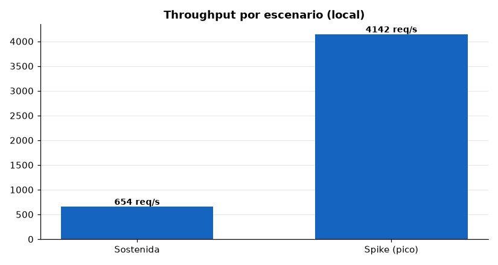
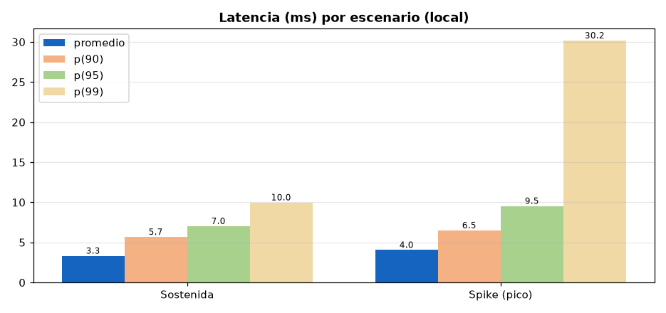
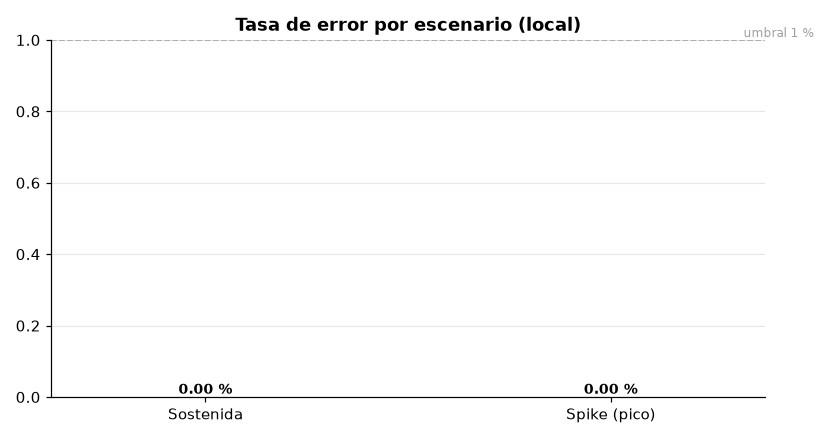
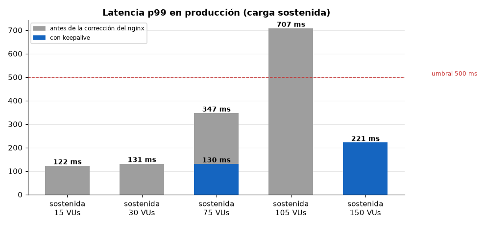

# Pruebas de carga (k6)

## Cómo correrlas: `run.sh` + un `.env` por entorno

Las mismas pruebas sirven contra el stack local, staging y producción, desde cualquier
máquina con Docker (k6 corre en el contenedor `grafana/k6`; `verify` además necesita
`python3`). El destino y la carga salen de un archivo `.env`, no del código:

```bash
cd entregas_disenio_de_apis
cp load-tests/env/staging.env.example load-tests/env/staging.env   # completa BASE_URL y credenciales
load-tests/run.sh smoke     load-tests/env/staging.env   # 1) valida conectividad, TLS y login
load-tests/run.sh sustained load-tests/env/staging.env   # 2) escenario (spike, breakpoint, dashboard-heavy)
load-tests/run.sh verify    load-tests/env/staging.env   # e2e de scripts/verify_delivery.py
```

Cada corrida imprime el destino y guarda el resumen en `load-tests/results/<env>-<escenario>-<fecha>.json`
(ignorado por git). Contra un destino que no es local, `sustained`, `spike`, `breakpoint`,
`dashboard-heavy` y `verify` piden confirmación (`ASSUME_YES=1` la omite, p. ej. en CI).

| Variable (en el `.env`) | Para qué |
|---|---|
| `BASE_URL` | **Obligatoria.** `https://api.midominio.com`, `https://<ip-ec2>` o `http://backend:8080` |
| `RUTA_ADMIN` / `RUTA_PASSWORD` | Admin del entorno (**obligatoria** la contraseña; la misma de `deploy/env/<entorno>.env` en la EC2) |
| `INSECURE_TLS` | `true` no verifica el certificado: necesario al ir directo a la EC2 con el Origin Certificate de Cloudflare |
| `LOAD_SCALE` | Multiplica VUs y tasas (`1` = perfil documentado abajo; `0.2` = 20 %). Las duraciones no cambian. Los escenarios con umbral `abortOnFail` (`breakpoint`) siguen cortando donde se crucen |
| `P95_MS` | Reemplaza el umbral de p(95) de cada escenario (útil si la latencia de red desde tu máquina es alta) |
| `USER_AGENT` | Por defecto `RutaLoadTest/1.0`: identificable en logs y en reglas de Cloudflare (el de k6 o `Python-urllib` por defecto lo pueden bloquear las reglas de bots) |
| `K6_DOCKER_NETWORK` | Solo local: red de Docker a la que unir k6 |
| `RUTA_DRIVER` / `RUTA_DRIVER_PASSWORD` | Solo `verify`: conductor del entorno (por defecto `conductor` / `conductor123`) |
| `RUTA_CHECK_FIXTURES` | Solo `verify`: `0` omite la comprobación de los datos del seed demo (59 facturas / 50 PIN); usa `0` si el entorno no se sembró con `demo/invoices.json` |

Sin comillas en los valores: `docker --env-file` no las quita.

### Contra la EC2 desde otra máquina

Dos formas de llegar, se elige con `BASE_URL`/`INSECURE_TLS`:

1. **Por el dominio (Cloudflare)** — el camino real de los usuarios: `BASE_URL=https://api.midominio.com`,
   `INSECURE_TLS=false`. Cloudflare puede desafiar o limitar mucho tráfico desde una sola IP
   (Bot Fight Mode, rate limiting), y eso contaminaría la medición: para `spike` y `breakpoint`
   crea una regla que omita esas protecciones para tu IP o usa la vía 2.
2. **Directo a la EC2** — `BASE_URL=https://<ip-o-dns-ec2>`, `INSECURE_TLS=true`. Requiere abrir
   el security group de la EC2 en 443 a la IP de la máquina de pruebas (y cerrarlo después).
   Saltarse Cloudflare también quita su capa de protección: no mides ese salto.

Recomendación: empezar por `smoke`, luego `LOAD_SCALE=0.1`–`0.2` e ir subiendo. Un perfil sin
escalar (150/750 VUs, hasta 10 000 req/s) contra una EC2 pequeña mide a la EC2, no a la app.
`verify` **escribe datos** (crea facturas `VERIFY/...` y confirma entregas) también en
producción; no borra lo que crea.

### Stack local (reproduce los resultados de abajo)

```bash
docker compose -f deploy/docker-compose.yml --env-file deploy/env/local.env up -d --build --wait
cp load-tests/env/local.env.example load-tests/env/local.env    # RUTA_PASSWORD = ADMIN_PASSWORD de deploy/env/local.env
load-tests/run.sh sustained load-tests/env/local.env
```

El backend no publica su puerto al host en el compose unificado (solo nginx lo hace, y nginx
no reenvía `/v3/api-docs` ni rutas fuera de `/api/`), así que en local k6 se une a la **red
de Docker Compose** (`K6_DOCKER_NETWORK=ruta-delivery-local_default`, que sale de
`COMPOSE_PROJECT_NAME`; con otro nombre de proyecto, ajustar). Los comandos `docker run`
de los resultados de abajo son equivalentes a `run.sh` con ese `.env`.

Todos los escenarios (`sustained.js`, `spike.js`, `breakpoint.js`, `dashboard-heavy.js`)
declaran `summaryTrendStats: ['avg', 'min', 'med', 'max', 'p(90)', 'p(95)', 'p(99)']`, así
que tanto el resumen de consola como el `--summary-export` incluyen **p99** (antes solo se
reportaba hasta p95).

## Resultados locales (2026-09-27, `deploy/docker-compose.yml`, stack local, `DB_POOL_MAX_SIZE=10`)

### Carga sostenida (Load/Stress Testing)

0→150 VUs en 3 min, meseta de 150 VUs por 7 min, bajada a 0 en 2 min (dentro del rango
mínimo exigido: 100-200 VUs, ramp-up 2-3 min, meseta 5-10 min, ramp-down 1-2 min).

```bash
docker run --rm -i --network ruta-delivery-local_default -v "$PWD":/scripts \
  -e BASE_URL=http://backend:8080 -e RUTA_PASSWORD=<...> \
  grafana/k6 run --summary-export=/scripts/local/results-sustained.json /scripts/sustained.js
```

| Indicador | Resultado | Umbral | Cumple |
|---|---:|---:|---|
| Throughput | 654,3 req/s (510 889 peticiones, todas 200) | — | — |
| Latencia promedio | 3,3 ms | — | — |
| p90 | 5,7 ms | — | — |
| p95 | 7,0 ms | < 500 ms | ✅ |
| **p99** | **10,0 ms** | — | — |
| Tasa de error | 0,00 % | < 1 % | ✅ |




### Recursos durante la sostenida (local)

| Recurso | Promedio en la meseta | Máximo | Límite / lectura |
|---|---:|---:|---|
| CPU del backend | 95,4 % de un núcleo | 110,6 % | Es el recurso que se acerca a su tope: el backend consume casi un núcleo completo |
| Memoria del backend | 664 MB | 677 MB | Límite del contenedor: 1 GB. Estable (sin crecimiento), sin reinicios ni `OOMKilled` |
| CPU de la VM (20 núcleos) | 7,8 % | 8,5 % | Holgada |
| CPU de PostgreSQL | 32,3 % | 35,2 % | Holgada: la base de datos no es el límite |
| Memoria de PostgreSQL | 62 MB | 63 MB | — |
| Conexiones abiertas a la BD | 10 | 10 | Es el pool completo (`DB_POOL_MAX_SIZE=10`); vale lo mismo en reposo, así que no prueba por sí solo que el pool se agote |

Medido con `load-tests/monitor.sh` cada 5 s sobre la meseta de 7 min (54 muestras); en esta corrida k6
llama al backend directo, de modo que el nginx no está en la ruta (su CPU y sus `TIME_WAIT` son los del
reposo). Lectura: bajo 150 VUs el sistema es estable (error 0 %, memoria plana, sin reinicios) y el
primer recurso en acercarse a su límite es la CPU del backend, no la memoria ni la base de datos.


### Pico extremo (Spike Testing)

0→750 VUs (5x la meseta sostenida de 150 VUs) en 10 s, pico de 1 min 30 s y bajada a 0 en 5 s
(dentro del rango mínimo exigido: 5-10x la carga normal, pico de 1-2 min), seguido de una fase de
recuperación de 2 min con 5 VUs.

```bash
docker run --rm -i --network ruta-delivery-local_default -v "$PWD":/scripts \
  -e BASE_URL=http://backend:8080 -e RUTA_PASSWORD=<...> \
  grafana/k6 run --summary-export=/scripts/local/results-spike.json /scripts/spike.js
```

| Indicador | Resultado | Umbral | Cumple |
|---|---:|---:|---|
| Throughput (pico) | ~4 140 req/s (434 862 peticiones en 105 s) | — | — |
| Latencia promedio | 4,04 ms | — | — |
| p90 | 6,49 ms | — | — |
| p95 | 9,53 ms | < 1000 ms | ✅ |
| **p99** | **30,17 ms** | — | — |
| Tasa de error | 0,00 % (todas las respuestas 200) | — | ✅ |
| **Recuperación** (5 VUs, 2 min) | p95 6,65 ms, error 0,00 % | < 500 ms, < 1 % | ✅ |
| Estado del Circuit Breaker tras el spike | `CLOSED`, 0 llamadas rechazadas, 0 reintentos | — | Sin señal de saturación |



### Punto de ruptura (Breakpoint)

A diferencia de `sustained.js`/`spike.js` (que no se degradan ni con 750 VUs),
`breakpoint.js` sube la tasa de llegada sin techo (`ramping-arrival-rate`, 500→10 000
iteraciones/s objetivo; cada iteración hace 6 peticiones) sobre la misma mezcla de endpoints, con `abortOnFail` en los umbrales de
error y de `p(95)<500ms`: en cuanto se cruza, k6 corta la prueba ahí mismo — ese es el
breakpoint real, no un número elegido a mano.

```bash
docker run --rm -i --network ruta-delivery-local_default -v "$PWD":/scripts \
  -e BASE_URL=http://backend:8080 -e RUTA_PASSWORD=<...> \
  grafana/k6 run --summary-export=/scripts/local/results-breakpoint-pool10.json /scripts/breakpoint.js
```

| Indicador | Resultado al momento del corte |
|---|---:|
| Throughput | 4 548,9 req/s |
| Latencia promedio | 88,0 ms |
| VUs activas | 1 311 (tope alcanzado en la etapa de 1500 iter/s) |
| p90 | 380,2 ms |
| **p95** | **601,4 ms (cruza el umbral de 500 ms)** |
| **p99** | **699,2 ms** |
| Tasa de error | 0,00 % (el sistema se degrada en latencia, no cae) |


**Lectura:** el sistema nunca devuelve errores bajo esta mezcla de tráfico; lo que ocurre
al superar ~4 500 req/s es que la latencia se degrada exponencialmente (p95 pasa de
single-digit ms a >600 ms) hasta cruzar el umbral. `local/results-breakpoint-pool10.json` es la
salida cruda de esta corrida.

### Nota histórica: efecto del pool de HikariCP (`local/results-breakpoint-before.json`/`-after.json`)

Una ronda anterior (2026-09-26) comparó el breakpoint con `DB_POOL_MAX_SIZE=10` (valor por
defecto) contra `DB_POOL_MAX_SIZE=30`, en otra máquina y sin p99 configurado (por eso esos
dos archivos no traen `p(99)` en sus métricas — quedan como lo que son, evidencia de esa
ronda, no repetida aquí):

| Indicador | Antes (pool=10) | Después (pool=30) |
|---|---:|---:|
| Throughput al corte | 5 658 req/s | 6 301 req/s (+11 %) |
| p95 al corte | 503 ms | 509 ms |
| Tasa de error | 0,00 % | 0,00 % |

Subir el pool movió el techo ~11-16 % más allá antes de degradarse; el resto del límite en
esa máquina era CPU del contenedor del backend, no la base de datos. Los tokens JWT que
esos dos JSON guardaban en `setup_data` se redactaron por higiene (no aportan al análisis
de rendimiento). El número exacto de corte varía con la máquina donde se corre — lo
importante y estable es el orden de magnitud (varios miles de req/s) y que el sistema se
degrada en latencia, nunca en errores.

## Resultados en producción (2026-10-05, EC2 directo, sin Cloudflare, nginx con `keepalive`)

Corridas de `run.sh` con `env/production.env`; el `LOAD_SCALE` va en el nombre del JSON de
`results/`. Con `LOAD_SCALE=1` la sostenida son 150 VUs y el spike 750. Los errores son las
respuestas que k6 cuenta como fallidas (código ≥ 400 o sin respuesta: `status 0`). Antes de estas
corridas se corrigió el nginx de borde (ver "Qué cambió"); las corridas previas están en
`production/antes-keepalive/` y se dibujan en gris en las gráficas.

| Corrida | VUs máx | Peticiones | req/s | Prom. | p90 | p95 | p99 | max | Errores |
|---|---:|---:|---:|---:|---:|---:|---:|---:|---:|
| smoke 0.1 | 2 | 113 | 3,3 | 94,8 ms | 95,8 ms | 99,9 ms | 114,9 ms | 167 ms | 0 % |
| **sustained 0.5** | 75 | 232 879 | 296,6 | 107,3 ms | 103,0 ms | **106,7 ms** | **130,3 ms** | 3 406 ms | **0 %** |
| **sustained 1** | **150** | 462 757 | 589,8 | 108,4 ms | 111,4 ms | **122,2 ms** | **221,2 ms** | 3 487 ms | **0 %** |
| spike 0.67 (pico) | 503 | 117 833 | ~1 122 | 501,1 ms | 887,1 ms | 1 115,9 ms | 1 742,5 ms | 4 413 ms | 0,79 % |
| spike 1 (pico) | 750 | 129 452 | ~1 233 | 536,1 ms | 768,7 ms | 875,9 ms | 1 165,5 ms | 30 341 ms | 0,68 % |
| spike 0.67 (recuperación) | 5 | 3 000 | ~25 | 105,0 ms | 102,7 ms | 104,3 ms | 124,8 ms | — | **0 %** |
| spike 1 (recuperación) | 5 | 2 925 | ~24 | 109,7 ms | 104,6 ms | 105,3 ms | 125,5 ms | — | **0 %** |
| breakpoint 0.05 | hasta 200 | 169 985 | 604,5 (media) | 153,2 ms | 216,8 ms | 530,2 ms | 906,2 ms | 4 002 ms | 0 % |

Códigos HTTP (conteo de k6): sostenida, todas las peticiones 200 (232 879 y 462 757); spike, 200
y `status 0` (925 y 886, el 0,79 % y 0,68 % del pico) y ningún 5xx, ni 502 ni 503; breakpoint, todas
200. `status 0` es una petición sin respuesta (conexión reiniciada o tiempo agotado a >500 VUs);
el log del nginx no se ha revisado para esas corridas, así que la causa exacta queda sin confirmar.
El smoke no desglosa códigos (`smoke.js` no declara los umbrales de visibilidad).





### Qué cambió: del 6,35 % de error al 0 % (hallazgo → corrección → remedición)

Las corridas anteriores perdían peticiones a partir de ~300–390 req/s. El log del nginx mostraba
`connect() to backend:8080 failed (99: Address not available)` y respondía `502`: el nginx abría una
conexión TCP nueva por petición hacia el backend y agotaba los puertos efímeros. La corrección fue un
`upstream` con `keepalive` y HTTP/1.1 hacia el backend (`deploy/nginx/templates/`). Se repitieron
las pruebas con la misma carga y el mismo backend, sin otro cambio:

| Prueba | Antes | Con `keepalive` |
|---|---|---|
| Sostenida 75 VUs: p95 / p99 / error | 209,9 / 346,6 ms / 0 % | **106,7 / 130,3 ms / 0 %** |
| Sostenida 105 VUs (antes) y 150 VUs (ahora): error | **6,35 %** (105 VUs) | **0 %** (150 VUs) |
| Sostenida: throughput máximo medido | 388 req/s (105 VUs) | **590 req/s (150 VUs)** |
| Spike: error con el pico | 14,64 % (150 VUs) y 25,94 % (300 VUs) | **0,79 % (503 VUs) y 0,68 % (750 VUs)** |
| Breakpoint: causa del corte | error acumulado de 1,49 % a los ~2 min | **0 % de error**; corte por p95 en el 5.º escalón (~4 min 41 s) |

La mejora a 75 VUs (p95 a la mitad y p99 a poco más de un tercio) y el paso de 6,35 % a 0 % son atribuibles al cambio del
nginx: es lo único que varió entre las dos tandas. No hay medición de CPU o memoria de la EC2 de esas
corridas que permita explicar *por qué* la latencia se redujo más allá del log que identificó la causa.

### Spike y recuperación en producción


- **Forma:** 0→pico en 10 s, 1 min 30 s de pico y bajada a 0 en 5 s; después, 2 min con 5 VUs
  (`recovery`). Con `LOAD_SCALE=0.67` el pico son 503 VUs (6,7× los 75 VUs de la carga normal) y con
  `1` son 750 (10×): ambos dentro del rango de 5–10× del enunciado.
- **Durante el pico:** la instancia sigue respondiendo (1 122 y 1 233 req/s), pero la latencia sube
  (p95 de 1 116 ms con 503 VUs y 876 ms con 750 VUs; el primero supera el umbral de 1 000 ms, el segundo
  no) y se pierde el 0,7–0,8 % de las peticiones, por debajo del 1 %. Que el p95 de 750 VUs sea menor que
  el de 503 VUs indica variabilidad entre corridas, no mejora con la carga. El máximo de 30,3 s de la
  corrida de 750 VUs es una petición aislada.
- **Recuperación:** en cuanto baja la carga el sistema vuelve solo a su estado normal: p95 de 104–105 ms
  y 0,00 % de error en las dos corridas, la misma latencia que en la sostenida de 75 VUs. No hubo caídas
  en cascada, y el backend no se reinició ni tuvo `OOMKilled`.
- **Caché, rate limiting y autoescalado:** no se aíslan en esta prueba (solo hay lecturas del admin y
  una única instancia, sin autoescalado).

### Punto de ruptura (breakpoint) en producción

`breakpoint.js` sube la tasa de llegada en 6 escalones de 1 min y etiqueta cada petición con su escalón.
Con `LOAD_SCALE=0.05` los objetivos son 25→500 iteraciones/s (cada iteración son 6 peticiones, o sea
150→3 000 req/s). `breakpoint_cut.py` resume por escalón:

| Escalón | Objetivo (req/s) | Throughput efectivo | p95 | Error |
|---|---:|---:|---:|---:|
| s1 | 150 | 144 req/s | 103 ms | 0 % |
| s2 | 150→450 | 257 req/s | 101 ms | 0 % |
| s3 | 450→900 | 562 req/s | 101 ms | 0 % |
| s4 | 900→1 500 | **967 req/s** | 108 ms | 0 % |
| s5 | 1 500→2 400 | 904 req/s | **761 ms** | 0 % |


**El punto de ruptura está entre 900 y 1 500 req/s de tasa objetivo, con un techo efectivo de ~970 req/s**
(~160 iteraciones/s): hasta el escalón 4 el p95 es de ~100 ms; en el 5.º el throughput ya no crece (904 req/s,
por debajo del anterior) y el p95 se dispara a 761 ms (×7), lo que cruza el umbral de 500 ms y corta la
prueba (~4 min 41 s). **No hay errores HTTP: el sistema se degrada en latencia, no cae.** Resolución:
un escalón (1 min). Cautela: en ese escalón se alcanzó el tope de 200 VUs del escenario (816 iteraciones
descartadas), así que una parte del déficit entre objetivo y efectivo puede venir del generador; el salto del
p95, en cambio, es del servidor.

### Comparativa local vs producción (sostenida, mismos 150 VUs)


| | Local (150 VUs) | Producción (150 VUs) |
|---|---:|---:|
| Throughput | 654,3 req/s | 589,8 req/s |
| p95 | 7,0 ms | 122,2 ms |
| p99 | 10,0 ms | 221,2 ms |
| Errores | 0 % | 0 % |

Con la misma carga y el mismo perfil de prueba, ambos cumplen los umbrales (error < 1 %, p95 < 500 ms).
La diferencia de latencia es sobre todo el RTT de red (~100 ms hasta la EC2; el mínimo de las corridas es
~86 ms) más el nginx; local corre en la red de Docker, sin red de por medio.

**Lectura:**

- La latencia base es el RTT de red (mínimo ~86 ms): hasta 150 VUs el backend aporta poco por encima de él
  (p95 de 122 ms con 150 VUs).
- **Capacidad medida de la instancia:** ~590 req/s sostenidos (150 VUs) sin errores y p95 de 122 ms, con un
  techo efectivo de ~970 req/s a partir del cual el p95 se degrada. Antes de la corrección del nginx el techo
  era de ~300–390 req/s.
- **Recursos:** tras toda la tanda el backend tiene 0 reinicios y `OOMKilled=false` (`docker inspect` del
  contenedor de producción). La CPU, la memoria y la base de datos de la EC2 durante las corridas **no están
  medidas** en este reporte; las medidas completas son las del stack local (ver arriba), donde el backend
  consume casi un núcleo y la memoria es estable.
- Hay outliers aislados (hasta 3,5 s en la sostenida y 30 s en un spike, de una petición entre cientos de
  miles) sin errores asociados.
- Desde esta ronda las peticiones del tablero llevan `tags: { name: ... }` y no hay aviso de cardinalidad
  de métricas; el resumen exportado no separa la latencia por endpoint, así que no se puede atribuir la
  cola del 5.º escalón a una ruta concreta.

### Cómo leer estos números: es un monolito, la carga no se distribuye

La app es un **monolito desplegado como una sola instancia**: un contenedor `backend` (una
JVM, `mem_limit` 1 GB por defecto), un `nginx` delante y una EC2. Según
`deploy/env/production.env.example` la base de datos es RDS, un servicio aparte, pero todo
el código de negocio corre en un único proceso. No hay balanceador ni réplicas, así que **el
100 % del tráfico cae en el mismo nodo** y comparte sus recursos:

- **Una sola capacidad que medir.** Lo que miden estas pruebas es lo que aguanta *una*
  instancia (CPU de la EC2, hilos de Tomcat, heap de la JVM, pool de Hikari de 10
  conexiones por defecto). Nada reparte la carga ni absorbe el exceso, por eso al acercarse
  al límite lo que se ve es una **cola** (p95 y p99 suben antes que la mediana), no errores.
  Es el patrón esperado de un nodo único: se degrada de forma gradual hasta saturarse.
- **Los endpoints se pisan entre sí.** Cada iteración pide seis rutas (búsqueda de facturas,
  historial, mapa, métricas, costo y estado del Circuit Breaker) y todas usan el mismo
  pool y la misma CPU. Las agregaciones del tablero (`/dashboard/map` y `/metrics`) compiten
  con las lecturas ligeras; en una arquitectura de servicios separados la ruta pesada no
  afectaría a las demás. Hoy el resumen de k6 no separa la latencia por endpoint, así que
  no se puede atribuir la cola a una ruta concreta (ver pendientes).
- **Por qué el local aguantó ~4 500 req/s y la EC2 menos.** Ambos son un solo nodo, pero el
  local es una máquina de desarrollo con CPU holgada y sin red de por medio; la EC2 es una
  instancia mucho más pequeña con ~100 ms de RTT. La comparación mide *tamaño de nodo*, no
  un cambio de arquitectura.
- **El generador también es un solo punto.** k6 corre desde una única máquina y una única
  ruta de red, así que parte de la cola y de los outliers de conexión puede venir del lado
  del cliente y no del servidor.

**Qué implica para escalar.** Con un monolito de una instancia, la salida inmediata es
**vertical** (más vCPU/RAM, subir `DB_POOL_MAX_SIZE`; en la ronda local pasar el pool de 10
a 30 movió el techo ~11 %). Escalar **horizontalmente** (varias réplicas detrás de un
balanceador) es viable porque la sesión viaja en una cookie JWT sin estado en el servidor,
pero hay estado local por instancia que habría que revisar antes: la caché Caffeine y el rate
limiting de bucket4j (login y `/confirm`) viven en memoria de cada réplica, así que con
varias los límites se multiplicarían y las cachés dejarían de ser coherentes entre sí.
Estos resultados sirven como línea base de capacidad *por instancia* para dimensionar eso:
~590 req/s sostenidos (150 VUs) con p95 ≈ 122 ms y error 0 % en esta EC2, y un techo efectivo de ~970 req/s.

## Medir recursos y analizar resultados

El enunciado pide verificar la estabilidad de CPU, memoria y base de datos durante la carga
sostenida. k6 solo mide el lado del cliente, así que los recursos se miden aparte, en tres capas.

**1. Servidor de aplicación (EC2): `monitor.sh`.** Se ejecuta EN la EC2, antes de lanzar k6, y se
detiene con Ctrl-C al terminar (deja ~1 min de margen a cada lado):

```bash
load-tests/monitor.sh stats-sostenida-1.0.csv      # intervalo por defecto: 5 s
# ... en otra terminal: load-tests/run.sh sustained load-tests/env/production.env ...
# Ctrl-C al terminar: imprime reinicios/OOMKilled del backend y el conteo de códigos HTTP del nginx
```

Escribe `ts_utc, host_cpu_pct, host_mem_used_mb, backend_cpu_pct, backend_mem_mb, nginx_cpu_pct,
nginx_mem_mb, nginx_timewait`. `nginx_timewait` son los sockets en `TIME_WAIT` del contenedor del
nginx: si se acerca a ~28 000 se agotan los puertos efímeros y aparecen 502 (`connect() failed (99:
Address not available)`). Copia el CSV a `production/recursos-<escenario>-<escala>.csv`;
`generar_graficas.py` dibuja CPU, memoria, `TIME_WAIT` y (si hay contenedor de PostgreSQL) la base de datos
en el tiempo, y `resumen_recursos.py <csv> <desde_UTC> <hasta_UTC>` calcula promedio y máximo de la meseta
(ventana: inicio de k6 + 3 min hasta + 10 min) listos para la tabla de la Fase 4.

**2. Base de datos (RDS): CloudWatch**, misma ventana horaria (UTC) de la corrida. En la consola:
RDS → la instancia → *Monitoring* → rango personalizado → capturas de `CPUUtilization`,
`DatabaseConnections`, `FreeableMemory`, `ReadIOPS`/`WriteIOPS` y `ReadLatency`/`WriteLatency`. Por
CLI, una llamada por métrica (guardar el JSON como `production/rds-<escenario>-<escala>.json`):

```bash
aws cloudwatch get-metric-statistics --namespace AWS/RDS --metric-name CPUUtilization \
  --dimensions Name=DBInstanceIdentifier,Value=<id> \
  --start-time 2026-10-05T01:50:00Z --end-time 2026-10-05T02:10:00Z \
  --period 60 --statistics Average Maximum
```

`DatabaseConnections` se compara con `DB_POOL_MAX_SIZE` (10 por defecto): si se queda pegado a
~10, el pool es el cuello; si es bajo, no.

**3. Créditos de CPU de la EC2 (si es de la familia t).** En CloudWatch → EC2: `CPUUtilization`,
`CPUCreditBalance` y `CPUSurplusCreditBalance`. Si el saldo llega a 0 durante la prueba, AWS limita
la CPU y la degradación no es del código.

**Códigos HTTP.** `sustained.js`, `spike.js` y `breakpoint.js` declaran umbrales de visibilidad
(`statusThresholds()` en `config.js`) para que el resumen exportado traiga `http_reqs{status:N}`
(status `0` = sin respuesta). Para corridas anteriores, el log del nginx da el mismo desglose:

```bash
docker logs --since <inicio-UTC> --until <fin-UTC> <nginx> 2>&1 \
  | awk '/ HTTP\/1\.[01]" /{print $9}' | sort | uniq -c | sort -rn
```

**Spike.** Sube a su pico en 10 s, lo mantiene 1 min 30 s y baja en 5 s; después corre el escenario
`recovery` (5 VUs fijos, 2 min). Los umbrales `http_req_*{phase:peak}` y `{phase:recovery}` dejan
en el resumen el p95 y el error de cada fase: si la recuperación vuelve a ~0 % de error y a la
latencia base, el sistema se recupera solo; si no, queda degradado. (El spike local de arriba se corrió con esta versión.)

**Breakpoint.** `breakpoint.js` etiqueta cada petición con su escalón (`s1`…`s6`, 1 min cada uno)
y `breakpoint_cut.py` imprime tasa objetivo, peticiones, error y p95 por escalón y señala el
primero que supera el umbral. El corte por `abortOnFail` usa el error *acumulado* y llega tarde:
el punto de ruptura real es ese escalón, no el instante del corte.

```bash
python3 load-tests/breakpoint_cut.py load-tests/results/production-breakpoint-0.05-<fecha>.json
python3 load-tests/resumen_corrida.py load-tests/results/production-*.json   # filas para las tablas
python3 load-tests/redact_results.py load-tests/production load-tests/results/production-*.json
```

`redact_results.py` copia los resúmenes a la carpeta versionada reemplazando el JWT de `setup_data`;
no subas a git los de `results/` tal cual.

## Procedimiento de corridas en producción (EC2)

Orden recomendado tras desplegar el `upstream` con `keepalive` del nginx (la plantilla se monta desde el
checkout del repo en la VM, no va en la imagen; no hace falta reconstruir ni redesplegar el backend). Para que
el cambio sea permanente la rama debe llegar a `main`: un despliegue posterior que haga checkout de un
commit sin ella devolvería la plantilla anterior:

```bash
# En la EC2: traer la rama y recrear SOLO el nginx. --force-recreate es necesario: la plantilla se
# procesa al arrancar el contenedor, y un `up -d nginx` a secas no detecta que el archivo cambio.
git fetch && git checkout <rama>
docker compose -f deploy/docker-compose.yml --env-file deploy/env/production.env up -d --force-recreate nginx
docker exec <nginx> sh -c 'grep -n "upstream\|keepalive" /etc/nginx/conf.d/default.conf'   # debe mostrar el upstream
docker exec <nginx> nginx -t && curl -k https://<ip>/healthz
```

Cambia `LOAD_SCALE` en `load-tests/env/production.env` entre corridas (usa `ASSUME_YES=1`), deja 4-5 min
entre una y otra y confirma antes de cada una que el backend no se reinició
(`docker inspect -f '{{.RestartCount}} {{.State.OOMKilled}}' <backend>`). En la EC2 corre `monitor.sh`
durante cada corrida (ver arriba); la base de datos y los créditos de CPU, en CloudWatch.

| # | Escenario | `LOAD_SCALE` | Qué demuestra | Criterio |
|---|---|---|---|---|
| 0 | smoke | 0.1 | El nginx nuevo responde bien | 0 % de error |
| 1 | sustained | 0.5 (75 VUs) | Línea base y recursos en carga normal | 0 % de error, p95 ≈ 210 ms o mejor |
| 2 | sustained | 1 (150 VUs) | Rango de 100-200 VUs con error < 1 % | error < 1 %, p95 < 500 ms |
| 3 | spike | 0.67 (500 VUs, ~6,7× la carga normal de 75 VUs) | Pico abrupto y **fase de recuperación** | recovery: error ~0 % y p95 de vuelta a la línea base |
| 4 | spike | 1 (750 VUs) — solo si el 3 fue estable | Extremo del rango 5-10× | se reporta lo que ocurra |
| 5 | breakpoint | 0.05 (25→500 iteraciones/s ≈ 150→3 000 req/s) | Punto de ruptura por escalón | `breakpoint_cut.py` |

Si la corrida 2 no baja del 1 % de error, reporta la de 0.7 (105 VUs, dentro del rango) y usa
`monitor.sh` para ver qué recurso limita: CPU del backend o de la VM pegada al tope → cómputo;
`TIME_WAIT` del nginx alto y 502 `Address not available` → el `keepalive` no aplicó; memoria del backend
cerca de 1 GB u `OOMKilled` → subir `BACKEND_MEM_LIMIT`; créditos de CPU en 0 → límite de AWS.
Después de cada corrida: `redact_results.py` → `production/`, `resumen_corrida.py` para las tablas y
`generar_graficas.py` (requiere matplotlib) para las gráficas.

## Gráficas y carpetas

- `local/` — resultados y gráficas del stack local (`local/graficas/`, `local/results-*.json`).
- `production/` — resultados (JWT redactado) de las corridas con el nginx corregido, CSV de recursos (`recursos-*.csv`) y gráficas de la EC2 (`production/graficas/`).
- `production/antes-keepalive/` — corridas previas a la corrección del nginx (con los 502), conservadas como referencia del antes/después.
- `comparativa/` — local vs producción.
- `generar_graficas.py` regenera `production/graficas/` y `comparativa/` (requiere matplotlib).
  Las de `local/graficas/` se generaron aparte (SVG→PNG) y no las regenera este script.

## Qué no se prueba y por qué

`POST /api/v1/driver/deliveries/confirm` no está incluido: cada factura solo se puede
confirmar una vez (regla real del dominio, no una limitación de la prueba), así que no hay
forma de repetirlo miles de veces sin generar una factura nueva por cada llamada. Se
prueban en cambio los endpoints de lectura, que reciben la mayor parte del tráfico real.

`dashboard-heavy.js` (tablero administrativo bajo un dataset de 500 entregas confirmadas
con foto real de ~200KB, ver `docs/EVALUACION_TECNICA.md` §9 para el hallazgo histórico
p95 21,91s→13,33ms) ya tiene `summaryTrendStats` con p99 agregado, pero no se volvió a
correr en esta ronda: no es uno de los escenarios mínimos que exige el enunciado (que pide
sostenida + spike), y requiere sembrar el dataset pesado de nuevo
(`scripts/generate_invoices.py` + `scripts/seed_confirmed_deliveries.py`) antes de medir.
